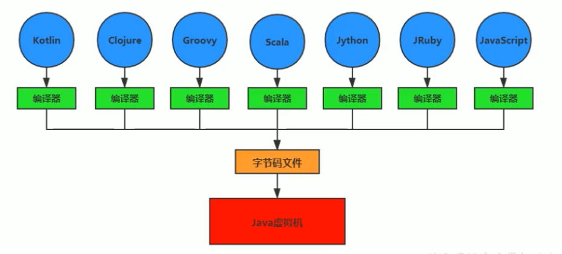

# JVM与JAVA体系结构

JVM -&gt; Java API -&gt; 框架\(e.g. Spring\) -&gt; 程序

JVM 是一个跨语言的平台。各语言用各自的编译器编译出**字节码文件\(class file\)**遵循JVM的规范，可以在JVM上解释运行。JVM不关心运行在其内部的程序是何种语言编写的，**只关心字节码文件**。

**虚拟机分类**

* **系统虚拟机** - 提供一个可运行完整操作系统的软件平台，是对物理计算机的仿真，例如Visual Box, VMware
* **程序虚拟机** - 专门为执行单个计算机程序而设计的虚拟机，例如Java虚拟机

**JVM 特点**

* 一次编译，到处运行
* 自动内存管理
* 自动垃圾回收功能

**JVM的位置**

**JDK的构成**

**JVM 的整体结构**

* Class loader将字节码文件\(class files\)加载到内存当中，生成一个class对象。
* 在内存中， 多线程共享方法区\(method area\)和堆\(heap\)
* Java栈，本地方法栈和程序计数器为线程私有
* 执行引擎\(Execution Engine\)包括解释器\(Interpreter\)，JIT即时编译器\(JIT Compiler\)和垃圾回收器\(Garbage Collection\)
  * 解释器是逐行解释字节码，响应时间快。
  * 即时编译器（后端编译）将热点代码（e.g. for循环中的重复代码）直接编译为本地机器指令并缓存以提高效率。

**Java代码执行流程**

**JVM的架构模型**

Java编译器输入的指令流基本上是一种**基于栈的指令集架构**，另一种指令集架构是**基于寄存器的指令集架构。**Hotspot虚拟机只有程序寄存器，没有其它寄存器。

* **基于栈的指令集架构特点**
  * 设计和实现更简单，适用于资源受限的系统（e.g. 机顶盒，打印机）
  * 避开了寄存器的分配难题：使用零地址指令分配方式分配（只对栈顶操作数操作，不需要地址）
  * 指令流中的指令大部分是零地址指令，其执行过程依赖于操作栈。**指令集更小**，编译器容易实现
  * 不需要硬件支持，可移植性更好，更好实现跨平台
* **基于寄存器的指令集架构特点**
  * 典型的应用是x86的二进制指令集：比如传统的PC以及android的Davlik虚拟机
  * 指令集架构则完全依赖硬件，可移植性差
  * 性能优秀和执行更高效
  * **花费更少的指令去完成一项操作**
  * 在大部分情况下，基于寄存器架构的指令集往往都以一地址指令、二地址指令和三地址指令为主，而基于栈的指令集是以零地址指令为主

**JVM的生命周期**

* 虚拟机的**启动**
  * Java虚拟机的启动时通过引导类加载器\(bootstrap class loader\)创建一个初始类\(initial class\)来完成的，这个类是由虚拟机的具体实现指定的。
* 虚拟机的**执行**
  * 一个运行中的Java虚拟机有着一个清晰的任务：执行Java程序
  * 程序开始执行时它才运行，程序结束时它就停止
  * 执行一个所谓的Java程序时，**真正在执行的是一个叫做Java虚拟机的进程**
* 虚拟机的**退出**
  * 程序正常执行退出
  * 程序在执行中遇到了异常或错误而异常终止
  * 由于操作系统出现错误而导致Java虚拟机进程终止
  * 某线程调用Runtime类或System类的exit方法，或Runtime类的halt方法，并且Java安全管理器也允许这次exit或halt操作
  * 此外，JNI\(Java Native Interface\)规范描述了用JNI Invocation API来加载或卸载Java虚拟机时，虚拟机的退出情况

**常见商用JVM介绍**

* HotSpot\(Oracle\) - 最常用，面试默认。通过编译器和解释器协同工作，在最优化的程序响应时间和最佳执行性能中取得平衡。
* JRockit\(Oracle\) - 专注于服务器端应用。不关注程序启动速度，因此不包含解释器。全部代码靠即时编译器编译后执行。JRockit Real Time提供毫秒或微秒级的JVM响应时间
* J9\(IBM\) - 定位与HotSpot接近。
* Graal VM\(Oracle\) - 2018年发布，跨语言全栈虚拟机，可以作为任何语言的运行平台使用

