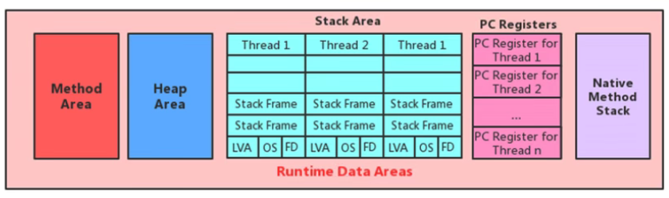
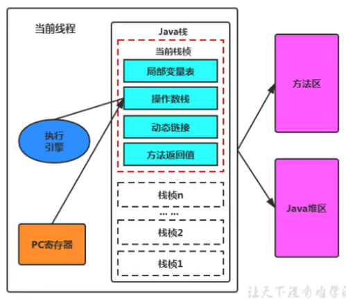
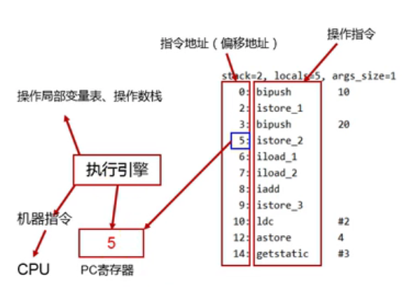

# 程序计数器（PC寄存器）

JVM中的程序计数器\(Program Counter Register\)用来存储指向下一条指令的地址，也就是即将要执行的指令代码，由执行引擎读取下一条指令。

JVM中，每个线程都有它自己的程序计数器，是线程私有的，生命周期与线程的生命周期保持一致。任何时间一个线程都只有一个方法在执行，也就是**当前方法**。程序计数器会存储当前线程正在执行的Java方法的JVM指令地址，或者，如果是在执行native方法，则是未定值\(undefined\)。

程序计数器没有GC，也是唯一一个在JVM中没有OutOfMemory的区域。

## 实例

参考Chapter04 - PCRegisterTest

## 两个常见面试问题

**为什么要使用PC计数器存储字节码指令地址（记录当前线程的执行地址）？**

因为CPU需要不停的切换各个线程，在切换回来之后，需要知道接下来从哪里开始继续执行。JVM的字节码解释器就需要通过改变PC计数器的值来明确下一条应该执行什么字节码指令。

**PC为什么计数器为什么会被设定为私有？**

由于CPU的时间片轮限制，众多线程在**并发**执行过程中，任何一个确定的时刻，一个处理器或多核处理器中的一个内核，只会执行某个线程中的一条指令，这样必然导致线程经常中断和恢复。为了能够准确地记录各个线程正在执行的当前字节码指令地址，最好的办法是为每一个线程分配一个PC计数器，使得各个线程之间可以独立计算，不会互相干扰。

## CPU时间片

**CPU时间片**是CPU分配给各个程序的时间，每个线程被分配一个时间段，成为其时间片。**多个线程看上去是并行执行，实际上是并发执行。**

* 并行：几个线程在同时执行，相对于串行
* 并发：几个线程交替执行。

