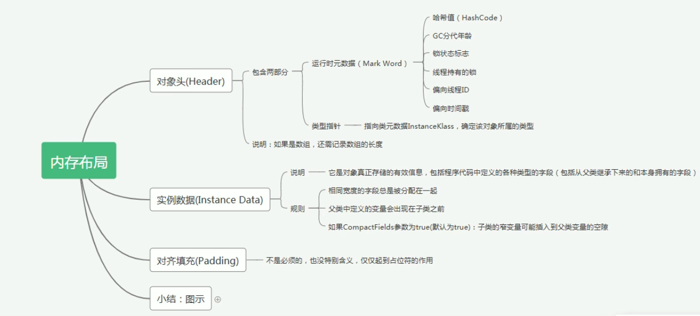
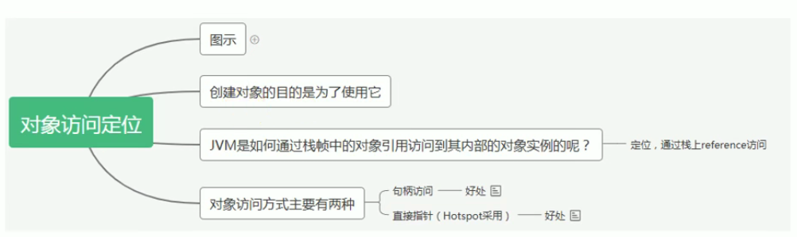
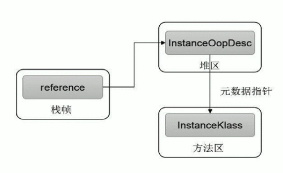
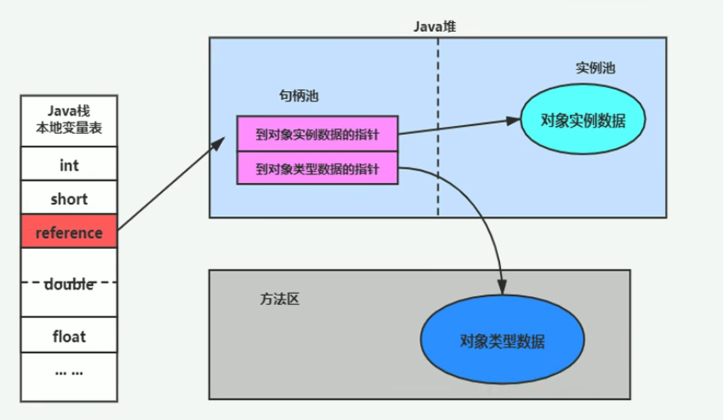
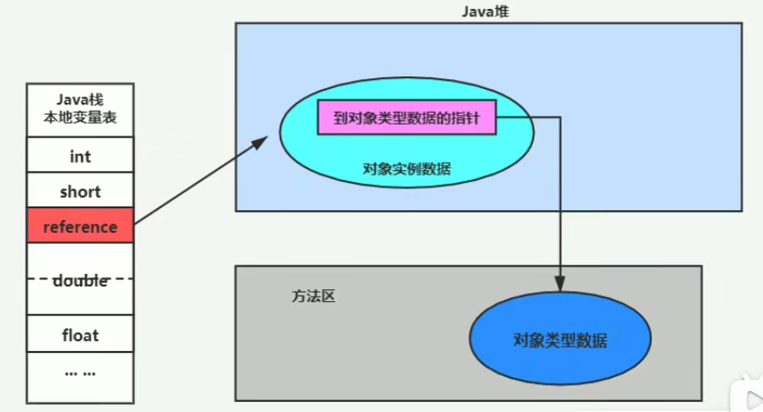

# 对象的实例化、内存布局与访问定位

## 对象的实例化

### **相关面试题**

* 对象在JVM中是怎么存储的？
* 对象头信息有哪些内容？

### 创建对象的方式

**new（类的构造器）**

* 最常见的方式
* 变形1：类的构造器不暴露，调用类的静态方法，静态方法中调用类的构造器
* 变形2：类的构造器不暴露，通过Builder/Factory等静态方法创建对象

**Class的newInstance\(\)**

* 反射的方式，只能调用空参的构造器，权限必须是public
* 因为条件太苛刻，Java9以后已经deprecated

**Constructor的newInstance\(xxx\) -** 反射的方式，比上面的方式灵活，可以调用空参或带参的构造器，对权限也没有要求

**clone\(\)** - 不调用任何构造器，当前的类需要实现Cloneable接口中的clone\(\)方法

**使用反序列化** - 从文件或网络中获取一个对象的二进制流，通过反序列化还原成对象

**第三方库Objenesis** 

### 创建对象的六个步骤

#### 判断对象对应的类是否加载、链接初始化

JVM遇到一条new指令，首先去检查这个指令的参数是否能在元空间的常量池中定位到一个类的符号引用，并且检查这个符号引用代表的类是否已经被加载解析和初始化。如果没有，那么在双亲委派模式下，使用当前类加载器以**ClassLoader+包名+类名**为Key查找对应的.class文件。如果没有找到文件，则抛出ClassNotFoundException，如果找到，则进行类加载，生成对应的Class类对象

#### 为对象分配内存

首先计算对象占用空间大小，接着在堆中划分一块内存给新对象。如果实例成员变量是引用变量，仅分配引用变量空间即可，即4个字节。

* 如果内存规整，那么JVM采用指针碰撞法\(Bump The Pointer\)为对象分配内存。即所有用过的内存在一边，空闲的内存在另一边，中间放着一个指针作为分界点的指示器。分配内存就是把指针向空闲那边移动一段与对象大小相等的举例。如果垃圾回收选择的是基于压缩算法的如Serial,ParNew这种可以解决内存碎片化问题，一般这样的JVM使用指针碰撞。
* 如果内存不规整，即已用内存和未用内存相互交错，那么JVM采用空闲列表法\(Free List\)为对象分配内存。即JVM维护了一个列表，记录哪些内存块可用，在分配的时候，从列表中找到一块足够大的空间划分给对象实例，并更新列表。
* **选择哪种分配方式由Java堆是否规整决定，而Java堆是否规整由所采用的垃圾回收器是否带有压缩整理功能决定。**

#### 处理并发安全问题

* 采用CAS\(Compare and Swap\)失败重试、区域加锁保证更新的原子性
* 在伊甸园区每个线程预先分配一块TLAB

#### 初始化分配到的空间

即对对象进行默认初始化，所有属性设置默认值，保证对象实例字段在不赋值时可以直接使用。

* **&lt;相关知识&gt;** 给对象的属性赋值的几种操作 - 参考Chapter10 - Customer
  * 属性的默认初始化
  * 显式初始化
  * 代码块中初始化
  * 构造器中初始化

#### 设置对象的对象头

将对象的所属类（即类的元数据信息， 指向方法区）、对象的HashCode和对象的GC信息、对象的锁信息等数据存储在对象的对象头中。

#### 执行init方法&lt;init&gt;进行初始化

初始化成员变量，执行实例化代码块，调用类的构造方法，并把堆内对象的首地址赋值给引用变量。即显式初始化/代码块中初始化/构造器中初始化 - 参考Chapter10 - Customer

## 对象的内存布局

### 对象头\(Header\)

**包括两部分：（面试常考）**

* 运行时元数据\(Mark Word\)
  * 哈希值
  * GC分代年龄
  * 锁状态标志
  * 线程持有的锁
  * 偏向线程ID
  * 偏向时间戳
* 类型指针 - 指向类元数据InstanceKlass，确定对象所属的类型（即这个对象是从哪个class来的）

如果对象是数组，还需要记录数组长度

### 实例数据\(Instance Data\)

对象真正存储的有效信息，包括程序代码中定义的各种类型的字段，包括从父类继承下来的和本身拥有的字段。

规则：

* 父类中顶一顶变量会出现在子类之前
* 同级别的变量中，相同宽度的字段总是被分配在一起
* 如果CompactFields参数为true\(default: true\)，子类的窄变量可能插入到父类的变量的空隙之中

### 对齐填充\(Padding\)

起到占位符的作用，不一定存在

### 图例

下图对应了Chapter10 - CustomerTest

## 对象的访问定位

### **JVM是如何通过栈帧中的对象引用访问到其内部的对象实例的？**

**通过栈上引用\(reference\)**

### **对象访问的两种方式**

#### 句柄访问

**优点**：reference中存储稳定句柄地址，对象被移动\(如GC\)时，只需改变句柄中的实例数据指针即可，reference本身不需要被修改

**缺点**：对象访问需要经过句柄池，效率低，而且需要单独维护一片句柄池的空间

#### 直接指针\(Hotspot采用这种方式\)

**优点**：对象访问效率高，不需要维护单独的句柄空间

**缺点**：对象被移动\(如GC\)时，需要修改reference

