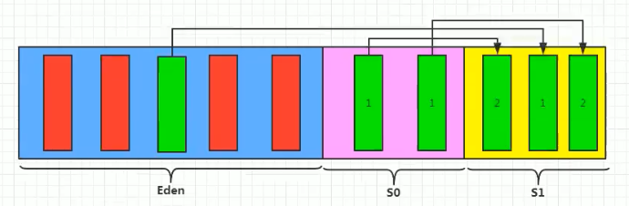
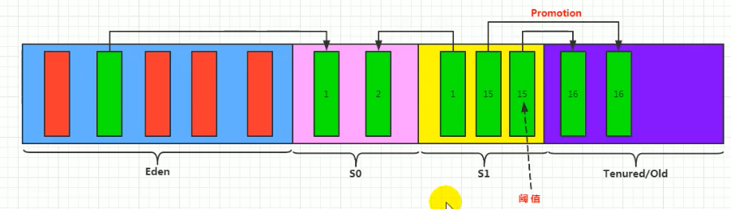
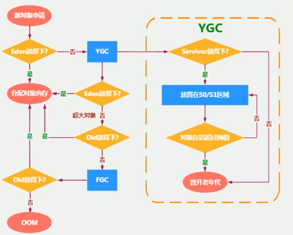

# 堆

## 堆的核心概念

### 概述

一个进程对应一个JVM实例，一个JVM实例对应一个运行时数据区，对应一个方法区和堆。一个进程中的所有线程共享方法区和堆空间。每个线程独立拥有一套程序计数器，本地方法栈和虚拟机栈。

Java堆区在JVM实例启动的时候被创建，其空间大小也就确定了。堆是JVM管理的最大一块内存空间。**堆内存的大小可以调节**。参考Chapter08 - HeapDemo and HeapDemo2

堆可以处于**物理上不连续**的内存空间中，但在**逻辑上应该视为是连续的**。

所有线程共享堆，但堆中可以划分线程私有的缓冲区\(Thread Local Allocation Buffer, **TLAB**\)

**几乎所有的**对象实例以及数组都在运行时分配在堆上，例外：逃逸分析，栈上分配。数组和对象可能永远不会存储在栈上，因为栈帧中保存引用，这个引用指向对象或者数组在堆中的位置。

在方法结束后，堆中的对象不会马上被移除，仅仅在垃圾收集的时候才会被移除。堆是GC执行垃圾回收的重点区域。


### 堆的细分内存结构

* 现代垃圾收集器大部分都是基于**分代收集理论**设计
* Java7及以前堆内存逻辑上分为：新生区+养老区+**永久区**
* Java8及之后堆内存逻辑上分为：新生区+养老区+**元空间**
* 新生区又被分为**Eden区**和**Survivor区**
* 命名：
  * 新生区 = 新生代 = 年轻代 = Young/New Generation Space
  * 养老区 = 老年区 = 老年代 = Old/Tenure Generation Space 
  * 永久区 = 永久代 = Permanent Space
  * 元空间 = Meta Space


## 设置堆内存大小与OOM

### 设置堆内存大小

* -Xms = -XX:InitialHeapSize - 用于设置堆区起始内存
* -Xmx = -XX:MaxHeapSize - 用于设置堆区最大内存
* 这里的堆空间**不包括永久代或元空间，只包括年轻代+老年代**
* 一旦堆区中的内存大小超过堆区最大内存，将会抛出OutOfMemoryError
* 通常会将 -Xms和-Xmx两个参数配置相同的值，目的是为了能够在Java垃圾回收机制清理完堆区后不需要重新分隔计算堆区大小，提高性能
* 默认情况下，初始内存 = 物理内存/64  最大内存 = 物理内存/4
* 查看设置的参数 
  * 方式1 - jps / jstat -gc ,进程id&gt;
  * 方式2 - -XX:+PrintGCDetails
* 参考Chapter08 - HeapSpaceInitial

### OOM

堆区内存大小超过堆区最大内存时，会抛出OutOfMemoryError，是Error，不是Exception。但广义上也可以认为是Exception

**Error vs Exception**

* 都继承于Throwable类。
* Exception是可以预见的意外情况，可以被捕获和处理
* Error是比较严重的错误，例如系统崩溃、虚拟机错误、内存不足、栈溢出。无法捕获和处理，一般只能让程序终止
* 面试中问到常见异常时，两者都可以广义地被认为是异常

## 年轻代与老年代

* 存储在JVM中的Java对象可以被分为两类
  * 一类对象生命周期较短的瞬间对象，这类对象的创建和消亡都非常迅速
  * 另一类对象生命周期非常长，极端情况下能够与JVM周期一致
* 堆区空间细分可分为年轻代\(YoungGen\)和老年代\(OldGen\)。年轻代又可细分为Eden空间，Survivor0空间和Survivor1空间


* 几乎所有的Java对象都是在Eden空间中被new出来
* 绝大部分的Java对象的销毁都在新生代进行

### 相关参数

**-XX:NewRatio -** 配置年轻代与老年代在堆结构的占比，默认值为2


默认 -XX:NewRatio=2  表示新生代占1， 老年代占2， 新生代占整个堆的1/3

```text
neverland@neverlands-mbp ~ % jps   # JVM Process status                              
4385 Launcher
4386 EdenSurvivor
4035 
4523 Main
4558 Jps
neverland@neverlands-mbp ~ % jinfo -flag SurvivorRatio 4386
-XX:SurvivorRatio=8
neverland@neverlands-mbp ~ % jinfo -flag NewRatio 4386 #check NewRation
-XX:NewRatio=2
```

参考Chapter08 - EdenSurvivor

**-XX:SurvivorRatio -** 配置年轻代中，Eden空间和另外两个Survivor空间的比例，默认值是8:1:1 但在jvisualvm中观察实际的比例是6:1:1，因为有自适应分配策略。-XX:-UseAdaptiveSizePolicy \(不使用自适应分配策略\(-表示不使用，+表示使用\)\)

**-Xmn** 设置新生代最大内存大小，当与-XX:NewRatio冲突时，以-Xmn为准

## 图解对象分配过程

### 步骤概述

* new的对象先放在伊甸园区\(Eden\)，此区有大小限制
* 当伊甸园区空间填满，程序又需要创建对象时，JVM的垃圾回收器将对伊甸园区进行垃圾回收**\(Minor GC，又叫YGC\(Young GC\)\)**，将伊甸园区中的不再被其它对象引用的对象进行销毁。再加载新的对象放到伊甸园区
* **当伊甸园区满时，会触发Minor GC，Minor GC会将伊甸园区和幸存者区一起垃圾回收。但幸存者区满时，不会触发Minor GC，有的对象可以直接晋升到老年区  \*面试考点**
* 然后将伊甸园区中的剩余对象移动到幸存者0区\(Survivor 0\)
* **特殊情况：**Minor GC之后伊甸园区应该为空（原来的对象要么被销毁，要么被放到幸存者区），如果伊甸园区空间仍然不够，说明新创建的对象是个超大对象，对象本身比伊甸园区空间还大，这时会尝试直接放到养老区。如果养老区空间不够，会触发Major GC，之后如果空间依然不够，则产生OOM异常
* 如果再次触发垃圾回收，此时上次幸存下来的在幸存者0区的对象如果没有被回收，就会被放到幸存者1区\(Survivor 1\)
* 如果再次经历垃圾回收，此时会重新放回0区，接着再去1区
* Survivor 0\(S0\)和Survivor 1\(S1\)又被称为From空间和To空间，S0, S1哪个空哪个为To空间。S0,S1必然有一个是空的
* 默认15次之后（每个对象有一个年龄计数器），会被放到养老区\(可以设置**-XX:MaxTenuringThreshold**更改默认次数\)
* 当养老区内存不足时，会触发Major GC，进行养老区内存清理
* 如果养老区在Major GC之后依然内存不足，就会产生OOM异常`java.lang.OutOfMemoryError: Java heap space`
* 垃圾回收：**频繁在新生代收集，很少在养老区收集，几乎不在永久代/元空间收集**
* 参考Chapter08 - HeapInstance

### **图解**








## Minor GC, Major GC, Full GC

### 概述

* HotSpot JVM的GC按照回收区域分为两大种类型：**部分回收\(Partial GC\)和整堆回收\(Full GC\)**
* 部分回收\(Partial GC\)：不是完整回收整个Java堆的GC
  * **新生代回收\(Minor GC/Yound GC\)**
  * **老年代回收\(Major GC/Old GC\)**
  * 目前，只有CMS GC会有单独回收老年代的行为
  * 很多时候Major GC和Full GC混淆使用，需要具体分辨是老年代还是整堆回收
  * **混合回收\(Mixed GC\)**：回收整个新生代以及部分老年代的GC，目前只有G1 GC会有这个行为
* 整堆回收\(Full GC\)：收集整个Java堆和方法区的GC

### **新生代回收\(Minor GC\)的触发机制**

* 当新生代空间不足时，会触发Minor GC。这里是指，Eden空间满会触发，Survivor满不会触发（只会晋升到老年代）
* 因为Java对象大多数具备朝生夕灭的特性，所以Minor GC非常频繁，一般回收速度也比较快。
* Minor GC会引发STW\(Stop-The-World \)，暂停其它的用户线程，等垃圾回收结束，用户线程才恢复运行。但因为速度比较快，对性能影响较小。

### 老年代回收\(Major GC\)的触发机制

* Major GC发生在老年代，对象会从老年代消失
* 当老年代空间不足时，会尝试触发Minor GC，如果之后空间依然不足，则触发Major GC（一般来说，出现了Major GC会伴随至少一次的Minor GC，但并不绝对）
* Major GC的速度一般比Minor GC慢10倍以上，STW的时间更长
* 如果Major GC后，内存依然不足，则会报OOM

### 整堆回收\(Full GC\)的触发机制

* 调用System.gc\(\)时，系统建议执行Full GC，但不是必然执行
* 老年代空间不足
* 方法区空间不足
* 通过Minor GC后进入老年代的平均大小大于老年代的可用内存
* 由Eden区，s0区向s1区复制时，对象大于To Space可用内存，则把对象转存到老年代，且老年代可用内存小于该对象大小时
* **Full GC是开发和调优中要尽量避免的**

参考Chapter08 - GCTest

## 堆空间分代思想

**为什么要把Java堆分代？**

经研究，不同对象的生命周期不同，70%-99%的对象是临时对象，可以进行内存清理\(GC\)。**分代是为了优化GC性能**。如果没有分代，那么所有的对象都在一起，GC时就需要对堆的所有区域进行扫描。

## 内存分配策略（小结）

如果对象在Eden出生并经过一次MinorGC后仍然存活，并且能被Survivor容纳，将被移到Survivor空间中，并将对象年龄设为1岁。对象在Survivor没经过一次GC存活，年龄增加1岁。当年龄增加到一定程度（默认15岁）时，就会被晋升到老年代。

**内存分配策略**

* 优先分配到Eden
* 大对象直接分配到老年代 - 尽量避免程序中出现过多的大对象
* 长期存活的对象分配到老年代
* 动态对象年龄判断 - 如果Survivor区中相同年龄的所有对象大小总和大于Survivor空间的一半，年龄大于或等于该年龄的对象可以直接进入老年代，无需等到MaxTenuringThreshold中要求的年龄（默认15）
* 空间分配担保 - -XX:HandlePromotionFailure 当大量对象在GC之后仍然存活，把Survivor中容纳不下的对象放到老年代。

## 为对象分配内存 - TLAB

## 小结堆空间的参数设置

## 堆是分配对象的唯一选择吗


