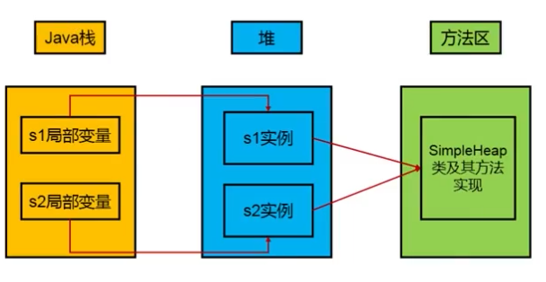
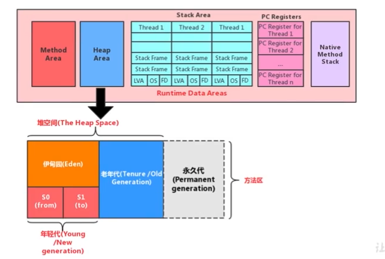
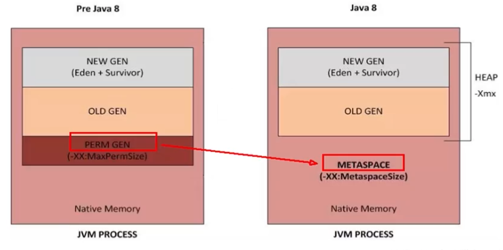
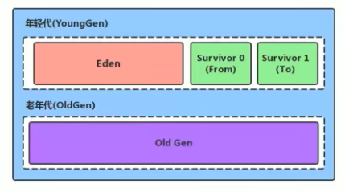
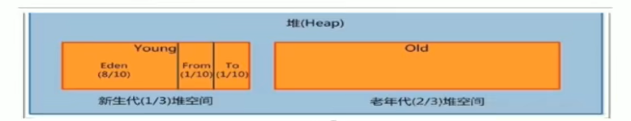

# 堆

## 堆的核心概念

### 概述

一个进程对应一个JVM实例，一个JVM实例对应一个运行时数据区，对应一个方法区和堆。一个进程中的所有线程共享方法区和堆空间。每个线程独立拥有一套程序计数器，本地方法栈和虚拟机栈。

Java堆区在JVM实例启动的时候被创建，其空间大小也就确定了。堆是JVM管理的最大一块内存空间。**堆内存的大小可以调节**。参考Chapter08 - HeapDemo and HeapDemo2

堆可以处于**物理上不连续**的内存空间中，但在**逻辑上应该视为是连续的**。

所有线程共享堆，但堆中可以划分线程私有的缓冲区\(Thread Local Allocation Buffer, **TLAB**\)

**几乎所有的**对象实例以及数组都在运行时分配在堆上，例外：逃逸分析，栈上分配。数组和对象可能永远不会存储在栈上，因为栈帧中保存引用，这个引用指向对象或者数组在堆中的位置。

在方法结束后，堆中的对象不会马上被移除，仅仅在垃圾收集的时候才会被移除。堆是GC执行垃圾回收的重点区域。

### 堆的细分内存结构

* 现代垃圾收集器大部分都是基于**分代收集理论**设计
* Java7及以前堆内存逻辑上分为：新生区+养老区+**永久区**
* Java8及之后堆内存逻辑上分为：新生区+养老区+**元空间**
* 新生区又被分为**Eden区**和**Survivor区**
* 命名：
  * 新生区 = 新生代 = 年轻代 = Young/New Generation Space
  * 养老区 = 老年区 = 老年代 = Old/Tenure Generation Space 
  * 永久区 = 永久代 = Permanent Space
  * 元空间 = Meta Space

## 设置堆内存大小与OOM

### 设置堆内存大小

* -Xms = -XX:InitialHeapSize - 用于设置堆区起始内存
* -Xmx = -XX:MaxHeapSize - 用于设置堆区最大内存
* 这里的堆空间**不包括永久代或元空间，只包括年轻代+老年代**
* 一旦堆区中的内存大小超过堆区最大内存，将会抛出OutOfMemoryError
* 通常会将 -Xms和-Xmx两个参数配置相同的值，目的是为了能够在Java垃圾回收机制清理完堆区后不需要重新分隔计算堆区大小，提高性能
* 默认情况下，初始内存 = 物理内存/64  最大内存 = 物理内存/4
* 查看设置的参数 
  * 方式1 - jps / jstat -gc ,进程id&gt;
  * 方式2 - -XX:+PrintGCDetails
* 参考Chapter08 - HeapSpaceInitial

### OOM

堆区内存大小超过堆区最大内存时，会抛出OutOfMemoryError，是Error，不是Exception。但广义上也可以认为是Exception

**Error vs Exception**

* 都继承于Throwable类。
* Exception是可以预见的意外情况，可以被捕获和处理
* Error是比较严重的错误，例如系统崩溃、虚拟机错误、内存不足、栈溢出。无法捕获和处理，一般只能让程序终止
* 面试中问到常见异常时，两者都可以广义地被认为是异常

## 年轻代与老年代

* 存储在JVM中的Java对象可以被分为两类
  * 一类对象生命周期较短的瞬间对象，这类对象的创建和消亡都非常迅速
  * 另一类对象生命周期非常长，极端情况下能够与JVM周期一致
* 堆区空间细分可分为年轻代\(YoungGen\)和老年代\(OldGen\)。年轻代又可细分为Eden空间，Survivor0空间和Survivor1空间

### 配置新生代与老年代在堆结构的占比

**默认 -XX:NewRation=2**  表示新生代占1， 老年代占2， 新生代占整个堆的1/3

参考Chapter08 - EdenSurvivor

## 图解对象分配过程

## Minor GC, Major GC, Full GC

## 堆空间分代思想

## 内存分配策略

## 为对象分配内存 - TLAB

## 小结堆空间的参数设置

## 堆是分配对象的唯一选择吗

