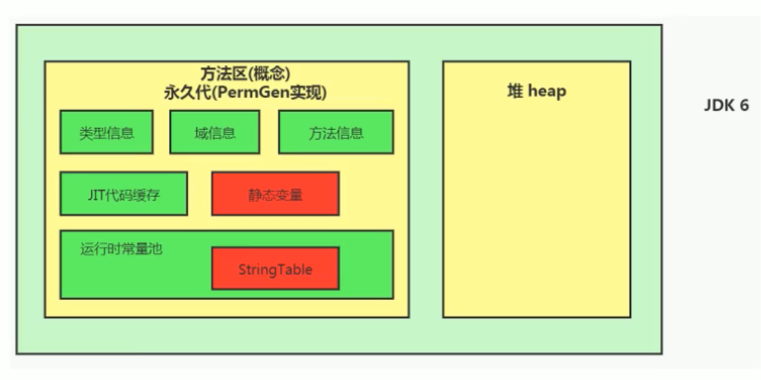
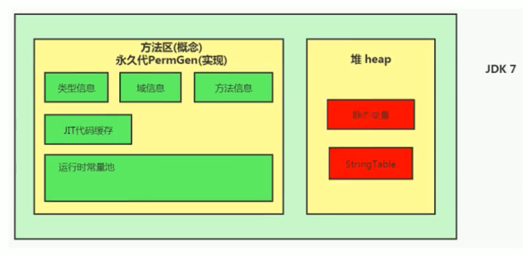
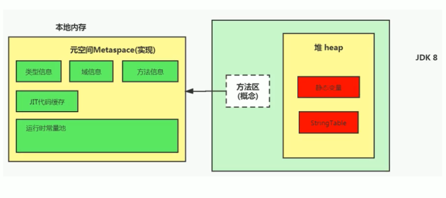
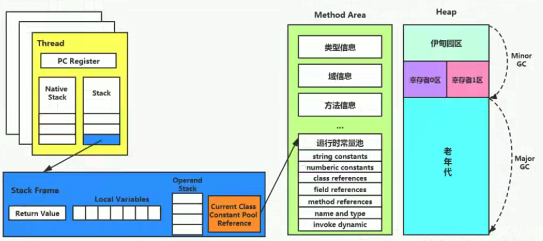

# 方法区

## 栈、堆、方法区的交互关系

### 从线程共享与否的角度看

### 交互关系

## 方法区的理解

* 方法区可以看作是一块独立于Java堆的内存空间。**类\(class\)放在方法区，new的对象放在堆空间**

* 方法区与堆一样，是各个线程共享的内存区域。一个类只被加载一次 - 如果同时多个线程要加载一个类，只能其中一个加载
* 方法区在JVM启动时被创建，并且和堆空间一样，它的实际物理内存可以是不连续的
* 方法区的大小可以选择固定大小，也可以选择可扩展大小，和堆空间一样
* 方法区的大小决定了系统可以保存多少个类。如果系统定义了太多的类（例如：加载大量第三方jar包；Tomcat部署的工程过多；大量动态的生成反射类），导致方法区溢出，JVM会抛出内存溢出错误\(OOM\) java.lang.OutOfMemoryError: **PermGen space** \(Java7及以前\) 或者 java.lang.OutOfMemoryError: **Metaspace** \(Java8以后\)
* 关闭JVM就会释放方法区内存

### Hotspot中方法区的演进

* **在jdk7及以前，方法区称为永久代\(Permanent generation\)；从jdk8开始，元空间\(Meta space\)代替了永久代**
* 本质上，方法区和永久代并不等价，此处仅仅是针对Hotspot JVM而已，因为JVM规范中对如何实现方法区没有统一要求，有些JVM不存在永久代
* 元空间的本质和永久代类似，最大的区别在于：**元空间不在虚拟机设置的内存中，而是使用本地内存\(native memory\)，**这样可以更不容易发生OOM
* 如果方法区无法满足新的内存分配需求时，将会抛出OOM异常

## 设置方法区大小与OOM

### 设置方法区内存的大小

* **jdk7及以前**
  * -XX:PermSize - 设置永久代初始分配空间，默认值20.75M
  * -XX:MaxPermSize - 设置永久代最大可分配空间。默认值64M\(32位机\) or 82M\(64位机\)
  * 当JVM加载的类信息容量超过了这个值，会报异常 **OutOfMemoryError: PermGen space**

* jdk8及以后
  * -XX:MetaspaceSize - 设置元空间的初始分配空间，默认值21M\(64位机\)
  * -XX:MaxMetaspaceSize - 设置元空间的最大可分配空间，默认值-1，即没有限制
  * 默认情况下，如果元空间耗尽所有可用的系统内存，会发生溢出，抛出**OutOfMemoryError: Metaspace** 异常
  * MetaspaceSize 是初始的高水位线，当元空间使用内存触及这个水位线后，会触发FullGC，并卸载没用到的类，然后将这个高水位线重置。新的高水位线的值取决于GC后释放了多少元空间。如果释放的空间不足，那么在不超过MaxMetaspaceSize时，会适当提高该值，如果释放的空间过多，则适当降低该值
  * 如果初始化的高水位线设置过低，上述的高水位线调整情况会发生多次，FullGC会多次被调用。**为了避免频繁GC，可以将MetaspaceSize设置为一个相对较高的值**

### **如何解决OOM**

参考Chapter09 - MaxMetaspaceSize

* 首先是通过内存映像分析工具\(Eclipse Memory Analyzer\)对dump出来的堆栈快照进行分析，重点是确认内存中的对象是否是必要的，即先分清楚是出现了内存泄漏\(memory leak\)还是内存溢出\(memory overflow\)
* 如果是内存泄漏，即应该被GC的对象没有被GC，可进一步通过工具查看泄漏对象到GC Roots的引用链。于是就能找到泄漏对象是通过怎样的路径与GC Roots相关联并导致GC无法自动回收它们的。
* 如果不存在内存泄漏，即内存中的对象确实应该存活，则应该检查虚拟机的堆参数\(-Xmx, -Xms\)，与物理内存对比，看是否可以调大。也可以从代码上检查是否存在某些对象生命周期过长、持有状态时间过长的情况，尝试减少程序运行期的内存消耗。

## 方法区的内部结构

方法区用于存储**已被虚拟机加载的类型信息、常量、静态变量、即时编译器编译后的代码缓存等**

### 类型信息

对每个加载的类型\(类、接口、枚举、注解\)，JVM必须在方法区中存储以下类型信息

* 类型的完整有效名称\(全名 = 包名.类名\)
* 类型直接父类的完整有效名称\(对于interface或java.lang.Object，都没有父类\)
* 类型的修饰符\(public, abstract, final\)
* 类型直接接口的一个有序列表

### 域信息（成员变量、属性）

域的相关信息包括：域名称、域类型、域修饰符\(public, private, protected, static, final, volatile, transient\)

### 方法信息

方法信息包括

* 方法名称
* 方法的返回类型\(或void\)
* 方法参数的数量和类型\(按顺序\)
* 方法的修饰符\(public, private, protected, static, final, synchronized, native, abstract\)
* 方法的字节码\(bytecodes\)、操作数栈大小、局部变量表及大小
* 异常表 - 每个异常处理的开始位置、结束位置、代码处理在程序计数器中的偏移地址、被捕获的异常类的常量池索引
* 参考Chapter09 - MethodAreaInnerStruc

### non-final的类变量

* 静态变量和类关联在一起，随着类的加载而加载，它们成为类数据在逻辑上的一部分
* 类变量被类的所有实例共享，即使没有类实例（实例为null），也可以访问
* 参考Chapter09 - NonFinalVariableDemo

### 全局常量\(static final\)

被声明为final的类变量的处理方式则不同，每个全局常量在编译时就会被分配了

### 常量池

* **常量池在字节码文件，运行时常量池在方法区**
* 字节码文件\(Class Files\)中的常量池经过类加载子系统加载到运行时数据区中的方法区后，对应的结构叫做运行时常量池
* 一个有效的字节码文件中包含类的版本信息、字段、方法以及接口等描述信息，还包含常量池表\(Constant Pool Table\)，包括各种字面量\(e.g. String s = "hello"\)和对类型、域和方法的符号引用
* 一个Java源文件在编译后产生一个字节码文件。而字节码需要数据支持，通常这种数据会很大以至于不能直接存在字节码中，需要换成另一种方式，即存到常量池。这个字节码文件包含了指向常量池的引用。在动态链接的时候，会用到运行时常量池。
* 常量池中存储的数据类型
  * 数量值
  * 字符串值
  * 类引用
  * 字段引用
  * 方法引用
* **常量池可以看作是一张表，虚拟机指令根据这张常量表找到要执行的类名、方法名、参数类型、字面量等类型**

### **运行时常量池**

* 运行时常量池是方法区的一部分
* 常量池表是字节码文件的一部分，**用于存放编译期生成的各种字面量与符号引用**，这部分内容**在类加载后存放到方法区的运行时常量池中**
* **JVM为每个已加载的类型（类或接口）都维护一个常量池。**池中的数据项像数组项一样，通过索引进行访问
* 运行时常量池中包含多种不同的常量，包括编译期就已明确数值的字面量，也包括到运行期解析后才能获得的方法或者字段引用。此时不再是常量池中的符号地址，而是换为真实地址 - **运行时常量池相对于常量池的一个重要不同是：具备动态性**
* 运行时常量池类似于传统编程语言中的符号表，但它所包含的数据比符号表更丰富一些
* 当构造运行时常量池所需的内存空间超过了方法区所能提供的最大值，则JVM会抛出OOM异常

## 方法区使用举例

参考Chapter09 - MethodAreaDemo 和视频P96

## 方法区的演进细节

* 只有HotSpot JVM有永久代，BEA JRockit, IBM J9等不存在永久代的概念
* HotSpot 中方法区的变化：
  * JDK6及以前 - 有永久代，静态变量存放在永久代
  * JDK7 - 有永久代，但字符串常量池\(String Table\)、静态变量保存在堆中
  * JDK8 - 无永久代，增加了元空间。类型信息、字段、方法、常量保存在元空间中（本地内存），字符串常量、静态变量仍在堆中 

* **永久代被元空间替换的原因（面试题）**
  * 为永久代设置空间大小是很难确定的。如果动态加载类过多，容易产生OOM。例如需要加载很多的jar包
  * 对永久代进行调优是很困难的 - FullGC中，判断一个类可以回收的标准很复杂，花费时间
* **JDK7中的StringTable为什么调整（面试题）**
  * 因为永久代的回收率很低，在FullGC的时候才会触发，导致StringTable的回收效率不高。而开发中会有大量的字符串被创建，回收效率低会导致永久代内存不足。放在堆中可以及时通过minorGC回收内存。

## 方法区的垃圾回收

方法区的垃圾回收主要回收两部分内容：**常量池中废弃的常量**和**不再使用的类型**

### **常量池中废弃的常量**

方法区内常量池中主要存放两类常量 - 字面量和符号引用：

* **字面量** - 常量，如文本字符串、被声明为final的常量值
* **符号引用包括**
  * 类和接口的全限定名
  * 字段的名称和描述符
  * 方法的名称和描述符

Hotspot虚拟机对常量池的回收策略：**只要常量池中的常量没有被任何地方引用，就可以被回收**

回收废弃常量与回收Java堆中的对象非常类似

### 不再使用的类型

判定一个类型是否不再被使用的条件比较苛刻，需要**同时**满足三个条件：

* 该类的所有实例都已经被回收，即Java堆中不存在该类及其任何派生子类的实例
* 加载该类的类加载器已经被回收
* 该类对应的java.lang.Class对象没有在任何地方被引用，无法在任何地方通过反射访问该类的方法

**满足这些条件的类允许被垃圾回收，但不一定会被回收**

## 总结

### 常见面试题

**百度**

* 说一下JVM内存模型有哪些区，分别做什么的？

**蚂蚁**

* Java8的内存分代改进
* JVM内存分哪几个区，每个区的作用是什么？
* JVM内存分布，内存结构？堆和栈的区别？堆的结构？为什么有两个Survivor区？（复制算法，避免碎片化，后面会讲）
* Eden和Survior的比例分配

**小米**

* JVM内存分区，为什么要有新生代和老年代

**字节**

* Java内存分区
* 讲讲JVM运行时数据区
* 什么时候对象会进入老年代

**美团**

* JVM中的永久代会发生垃圾回收吗？

