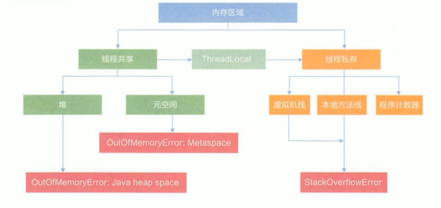
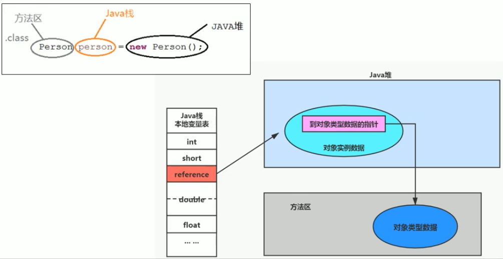
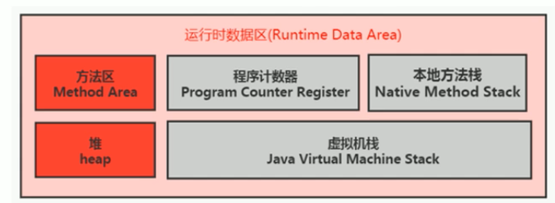
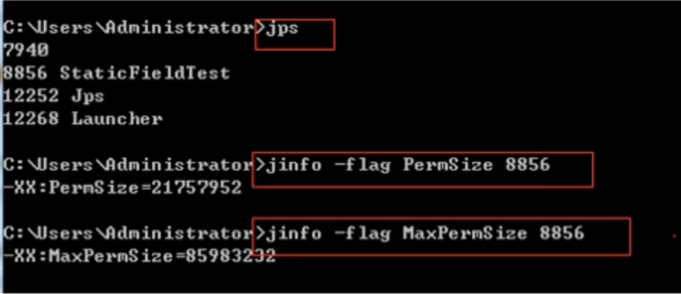
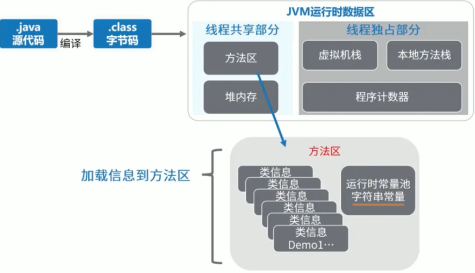

# 方法区

## 栈、堆、方法区的交互关系

### 从线程共享与否的角度看

### 交互关系

## 方法区的理解

### 方法区的基本概念

* 方法区可以看作是一块独立于Java堆的内存空间。**类\(class\)放在方法区，new的对象放在堆空间**

* 方法区与堆一样，是各个线程共享的内存区域。一个类只被加载一次 - 如果同时多个线程要加载一个类，只能其中一个加载
* 方法区在JVM启动时被创建，并且和堆空间一样，它的实际物理内存可以是不连续的
* 方法区的大小可以选择固定大小，也可以选择可扩展大小，和堆空间一样
* 方法区的大小决定了系统可以保存多少个类。如果系统定义了太多的类（例如：加载大量第三方jar包；Tomcat部署的工程过多；大量动态的生成反射类），导致方法区溢出，JVM会抛出内存溢出错误\(OOM\) java.lang.OutOfMemoryError: **PermGen space** \(Java7及以前\) 或者 java.lang.OutOfMemoryError: **Metaspace** \(Java8以后\)
* 关闭JVM就会释放方法区内存

### Hotspot中方法区的演进

* **在jdk7及以前，方法区称为永久代\(Permanent generation\)；从jdk8开始，元空间\(Meta space\)代替了永久代**
* 本质上，方法区和永久代并不等价，此处仅仅是针对Hotspot JVM而已，因为JVM规范中对如何实现方法区没有统一要求，有些JVM不存在永久代
* 元空间的本质和永久代类似，最大的区别在于：**元空间不在虚拟机设置的内存中，而是使用本地内存\(native memory\)，**这样可以更不容易发生OOM
* 如果方法区无法满足新的内存分配需求时，将会抛出OOM异常

## 设置方法区大小与OOM

### 设置方法区内存的大小

* **jdk7及以前**
  * -XX:PermSize - 设置永久代初始分配空间，默认值20.75M
  * -XX:MaxPermSize - 设置永久代最大可分配空间。默认值64M\(32位机\) or 82M\(64位机\)
  * 当JVM加载的类信息容量超过了这个值，会报异常 **OutOfMemoryError: PermGen space**

* jdk8及以后
  * -XX:MetaspaceSize - 设置元空间的初始分配空间，默认值21M\(64位机\)
  * -XX:MaxMetaspaceSize - 设置元空间的最大可分配空间，默认值-1，即没有限制
  * 默认情况下，如果元空间耗尽所有可用的系统内存，会发生溢出，抛出**OutOfMemoryError: Metaspace** 异常
  * MetaspaceSize 是初始的高水位线，当元空间使用内存触及这个水位线后，会触发FullGC，并卸载没用到的类，然后将这个高水位线重置。新的高水位线的值取决于GC后释放了多少元空间。如果释放的空间不足，那么在不超过MaxMetaspaceSize时，会适当提高该值，如果释放的空间过多，则适当降低该值
  * 如果初始化的高水位线设置过低，上述的高水位线调整情况会发生多次，FullGC会多次被调用。**为了避免频繁GC，可以将MetaspaceSize设置为一个相对较高的值**

### **如何解决OOM**

参考Chapter09 - MaxMetaspaceSize

* 首先是通过内存映像分析工具\(Eclipse Memory Analyzer\)对dump出来的堆栈快照进行分析，重点是确认内存中的对象是否是必要的，即先分清楚是出现了内存泄漏\(memory leak\)还是内存溢出\(memory overflow\)
* 如果是内存泄漏，即应该被GC的对象没有被GC，可进一步通过工具查看泄漏对象到GC Roots的引用链。于是就能找到泄漏对象是通过怎样的路径与GC Roots相关联并导致GC无法自动回收它们的。
* 如果不存在内存泄漏，即内存中的对象确实应该存活，则应该检查虚拟机的堆参数\(-Xmx, -Xms\)，与物理内存对比，看是否可以调大。也可以从代码上检查是否存在某些对象生命周期过长、持有状态时间过长的情况，尝试减少程序运行期的内存消耗。

## 方法区的内部结构

方法区用于存储**已被虚拟机加载的类型信息、常量、静态变量、即时编译器编译后的代码缓存等**

### 类型信息

对每个加载的类型\(类、接口、枚举、注解\)，JVM必须在方法区中存储以下类型信息

* 类型的完整有效名称\(全名 = 包名.类名\)
* 类型直接父类的完整有效名称\(对于interface或java.lang.Object，都没有父类\)
* 类型的修饰符\(public, abstract, final\)
* 类型直接接口的一个有序列表

### 域信息（成员变量、属性）

域的相关信息包括：域名称、域类型、域修饰符\(public, private, protected, static, final, volatile, transient\)

### 方法信息

方法信息包括

* 方法名称
* 方法的返回类型\(或void\)
* 方法参数的数量和类型\(按顺序\)
* 方法的修饰符\(public, private, protected, static, final, synchronized, native, abstract\)
* 方法的字节码\(bytecodes\)、操作数栈大小、局部变量表及大小
* 异常表 - 每个异常处理的开始位置、结束位置、代码处理在程序计数器中的偏移地址、被捕获的异常类的常量池索引
* 参考Chapter09 - MethodAreaInnerStruc

## 方法区使用举例

## 方法区的演进细节

## 方法区的垃圾回收

## 总结

