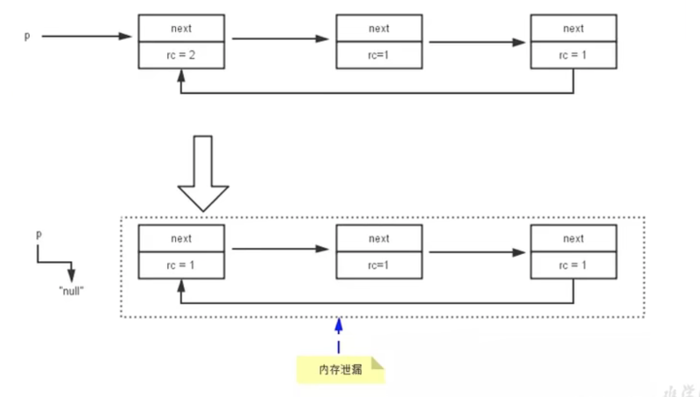
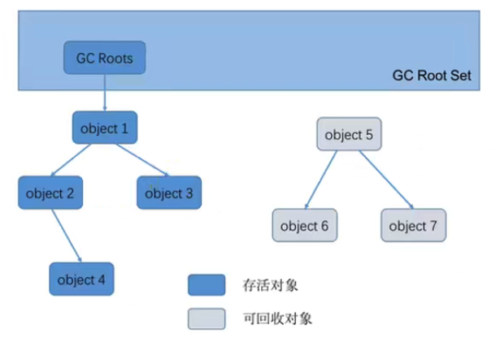
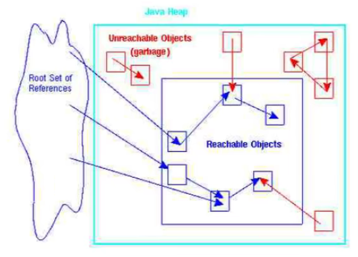

# 垃圾回收相关算法

## 标记阶段：引用计数算法

堆空间存放着几乎所有的Java对象实例，在GC执行垃圾回收之前，首先需要区分出内存中哪些是存活对象，哪些是已经死亡的对象。只有被标记为已经死亡的对象，GC才会在执行垃圾回收时，释放其所占用的内存空间，因此这个过程称为**垃圾标记阶段**

当一个对象已经不再被任何的存活对象继续引用时，就可以认为这个对象已经死亡。判断对象存活一般有两种方式：**引用计数算法**和**可达性分析算法**。

引用计数法\(Reference Counter\) 对每个对象保存一个整型的引用计数器属性，用于记录对象被引用的情况。对于一个对象A，只要有任何一个对象引用了A，则A的引用计数器加1；当引用失效时，引用计数器减1。只要A的引用计数器为0，则表示A不可能再被使用，可以进行回收。

**优点：**

* 实现简单，垃圾对象便于辨识；
* 判定效率高，回收没有延迟性

**缺点：**

* 需要单独的字段存储计数器，这样增加了存储**空间的开销**
* 每次赋值都需要更新计数器，伴随着加法和减法操作，增加了**时间的开销**
* 一个严重的问题：无法处理**循环引用**的情况 - **因而Java的GC中没有使用这类算法**
* Python中使用了这个算法，通过手动解除和使用弱引用\(weakref\)来解决循环引用的问题

## 标记阶段：可达性分析算法（根搜索算法、追踪性垃圾收集）

相对于引用计数算法，可达性分析算法不仅同样具备实现简单和执行高效等特点，还可以有效解决循环引用的问题，防止内存泄漏的发生。Java, C\#使用这个算法。

**基本思路**

* **根对象集合\(GC Roots\)**是指一组必须活跃的引用
* 可达性分析算法是以**根对象集合**为起始点，按照从上至下的方式搜索被根对象集合所连接的目标对象是否可达
* 使用可达性分析算法后，内存中的存活对象都会被根对象集合直接或间接连接着，搜索所走过的路径称为**引用链\(Reference Chain\)**
* 如果目标对象没有任何引用链相连，则是不可达的，就意味着该对象已经死亡，可以标记为垃圾对象
* 在可达性分析算法中，只有能被根对象集合直接或间接连接的对象才是存活的

**Java中，GC Roots包括以下几类元素（高频面试题）**

* 虚拟机栈中引用的对象，如各个线程被调用的方法中使用的参数、局部变量等
* 本地方法栈内JNI\(Java Native Interface, Java本地接口\)引用的对象
* 方法区中类静态属性引用的对象，如引用类型静态变量
* 方法区中常量引用的对象，如字符串常量池中的引用
* 所有被同步锁synchronized持有的对象
* JVM内部的引用，如基本数据类型对应的Class对象，一些常驻的异常对象，系统类加载器
* 反映JVM内部情况的JMXBean, JVMTI中注册的回调、本地缓存等
* 特殊情况 - 除了上述固定的GC Roots外，根据用户所选用的垃圾收集器以及当前回收的内存区域不同，还可以有其它对象临时性地加入，共同构成完整的GC Roots集合，比如**分代收集**和**局部回收**

**小结：如果一个指针，它保存了堆内存里面的对象，但自己又不存放在堆内存里面，则它是一个Root**

如果使用可达性分析算法来判断内存是否可回收，那么分析工作必须在一个能保障一致性的快照中进行，这点不满足的话，分析结果的准确性就无法保。这也是GC进行时必须"Stop The Wolrd"的一个重要原因，在枚举根节点时必须要停顿

## 对象的finalization机制

## MAT与JProfiler的GC Roots溯源

## 清除阶段：标记-清除算法

## 清除阶段：复制算法

## 清除阶段：标记-压缩算法

## 小结

## 分代收集算法

## 增量收集算法、分区算法

