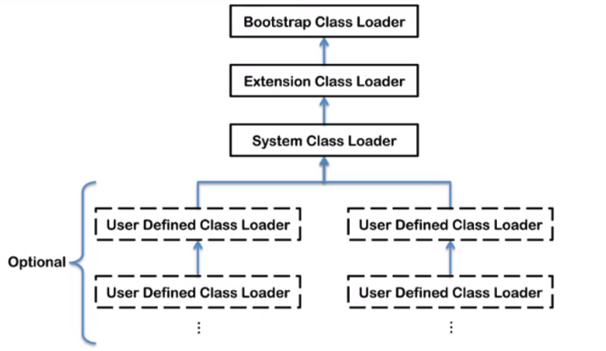
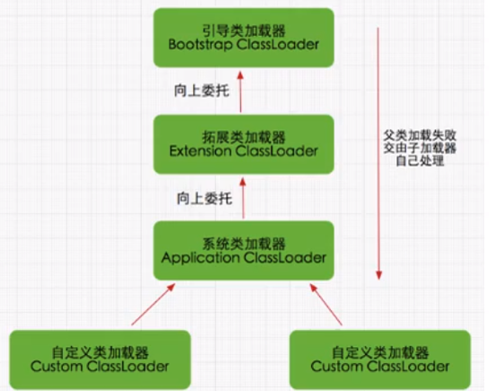

# 类加载子系统

## 内存结构概述

* LVA - Local Variables Array 局部变量表 
* OS - Operand Stack 操作数栈
* DL - Dynamic Linking 动态链接
* RA - Return Address 方法返回地址

## **类加载器\(Class Loader\)与类的加载过程**

三个阶段：**加载阶段，链接阶段，初始化阶段**

类加载器子系统负责从文件系统或网络中加载class文件，class文件在文件开头有特定的文件标识\(cafe babe\)。

ClassLoader只负责class文件的加载，至于其是否可以运行，由执行引擎决定

加载的类信息存放在一块称为方法区的内存空间。除了类的信息外，方法区中还会存放运行时常量池\(Constant pool\)信息，可能还包括字符串字面量和数字常量\(这部分常量信息是class文件中常量池部分的内存映射\)

**类加载器角色**

* class file 存在于本地硬盘上
* class file 加载到JVM中，被称为DNA元数据模板，放在方法区
* 在class file -&gt; JVM -&gt; 元数据模板过程中，类加载器扮演一个快递员的角色
* class元数据模板在方法区，class对象在堆

**类的加载过程**

**加载阶段**

* 通过一个类的全限定名获取定义此类的二进制字节流
* 将这个字节流所代表的静态存储结构转化为方法区的运行时数据结构
* 在内存中**生成一个代表这个类的java.lang.Class对象**，作为方法区这个类的各种数据的访问入口
* 加载class file的方式
  * 从本地系统直接加载
  * 通过网络获取 e.g. Web Applet
  * 从zip压缩包读取，成为日后jar, war格式的基础
  * 运行时计算生成 e.g. 动态代理技术 \(cglib\)
  * 由其它文件生成 e.g. JSP
  * 从专有数据库中提取
  * 从加密文件中获取 - 典型的防class file被反编译的保护措施 

**链接阶段**

* 分为三个子阶段：**验证，准备，解析**
* 验证
  * 目的在于确保class文件的字节流中包含信息符合当前虚拟机的要求，保证被加载类的正确性，不会危害虚拟机自身安全。如果不合法，会报verify error
  * 主要包括4种验证：文件格式验证，元数据验证，字节码验证，符号引用验证
* 准备 \(参考HelloApp.java\)
  * 为类变量分配内存并且设置该类变量的默认初始值，即零值
    * int -&gt; 0
    * float -&gt; 0.0
    * char -&gt; '\u0000'
    * boolean -&gt; false
    * 引用类型 -&gt; null
  * **这里不包含final修饰的static，因为final在编译的时候就会分配了，准备阶段会显式初始化。**被final修饰的是常量，不是变量**。**
  * **这里不会为实例变量分配初始化**，类变量会分配在方法区中，而实例变量是会随着对象一起分配到Java堆中。e.g. private static int a = 1; 在此时a 只会被设置为零值，即a=0。在初始化阶段a会被赋值为1。
* 解析
  * 将常量池内的符号引用转换为直接引用的过程
  * 事实上，解析操作往往会伴随着JVM在执行完初始化后再执行
  * 符号引用就是一组符号来描述所引用的目标。直接引用就是直接指向目标的指针、相对偏移量或一个间接定位到目标的句柄
  * 解析动作主要针对类或接口、字段、类方法、接口方法、方法类型等。

**初始化阶段**

* 初始化阶段就是执行**类构造器方法**&lt;clinit&gt;\(\)的过程
* 此方法不需定义，是javac编译器自动收集类中的所有**类变量的赋值动作**和**静态代码块**中的语句合并而来
* 构造器方法中指令**按语句在源文件中出现的顺序执行**
* &lt;clinit&gt;\(\)不同于类的构造器。关联：构造器是虚拟机视角下的&lt;init&gt;\(\)
* 当代码中没有类变量\(静态变量\)和静态代码块时，就没有&lt;clinit&gt;\(\)
* 任何一个类声明以后，内部至少存在一个类的构造器&lt;init&gt;\(\)
* 若该类具有父类，JVM会保证子类的&lt;clinit&gt;\(\)执行前，父类的&lt;clinit&gt;\(\)已执行完毕
* 虚拟机必须保证一个类的&lt;clinit&gt;\(\)方法在多线程下被同步加锁

## 类加载器分类

JVM支持两种类型的类加载器：**引导类加载器**\(Bootstrap ClassLoader\)和**自定义类加载器**\(User-Defined ClassLoader\)。所有派生于抽象类的类加载器\(abstract ClassLoader\)都划分为自定义类加载器。

这里四者之间的关系是包含关系，不是上层下层，也不是子父类的继承关系。引导类加载器是C/C++实现的，其它的加载器都是Java实现的。

Java的核心类库\(e.g. String\)都是使用引导类加载器进行加载。（参考ClassLoaderTest）

**引导类加载器**\(Bootstrap ClassLoader\)

* 这个类加载使用C/C++实现，嵌套在JVM内部
* 它用来加载Java的核心库\(JAVA\_HOME/jre/lib/rt.jar, resources.jar或者sun.boot.class.path路径下的内容\)，用于提供JVM自身需要的类
* 并不继承自java.lang.ClassLoader，没有父加载器
* 加载扩展类和应用程序类加载器，并指定为它们的父类加载器
* 出于安全考虑，Bootstrap启动类加载器只加载包名为java, javax, sun等开头的类

**扩展类加载器**\(Extension ClassLoader\)

* Java语言编写，由sun.misc.Launcher$ExtClassLoader实现
* 派生于ClassLoader类
* 父类加载器为引导类加载器
* 从java.ext.dirs系统属性所指定的目录中加载类库，或从JDK的安装目录的jre/lib/ext子目录下加载类库。**如果用户创建的JAR放在此目录下，也会自动由扩展类加载器加载。**

**系统类加载器**\(应用程序类加载器，AppClassLoader\)

* Java语言编写，由sun.misc.Launcher$AppClassLoader实现
* 派生于ClassLoader类
* 父类加载器为扩展类加载器
* 它负责加载环境变量classpath或系统属性java.class.path指定路径下的类库
* 该类加载是程序中默认的类加载器，一般来说，Java应用的类都是由它来完成加载
* 通过ClassLoader\#getSystemClassLoader\(\)方法可以获取到该类加载器

**需要自定义类加载器的场景**

* **隔离加载类** - 某些框架中使用的中间件和应用的模块是隔离的，这时需要把类加载到不同的环境当中，确保中间件和应用的jar包不冲突。
* **修改类加载的方式** - 在类加载过程中，引导类加载器是必需的，用来加载系统需要的核心API，但其它的类加载器不是必需的，因此可以在实际使用中根据需要实现动态加载。
* **扩展加载源** - 除了之前提到的可以字节码来源如物理磁盘、网络，可以扩展加载源，比如数据库、机顶盒等等。
* **防止源码泄漏** - Java 代码容易被反编译和篡改，因此可以加密字节码文件，通过自定义类加载器实现解密操作。

**用户自定义类加载器实现步骤**

* 开发人员可以通过继承抽象类java.lang.ClassLoader类的方式，实现自己的类加载器，以满足一些特殊需求
* 在JDK1.2之后，不再建议用户覆盖loadClass\(\)方法，而是建议把自定义的类加载逻辑写在findClass\(\)方法中
* 在编写自定义类加载器时，如果没有太复杂的需求，可以直接继承URLClassLoader类，这样可以避免自己去编写findClass\(\)方法及获取字节码流的方式，使自定义类加载器编写更加简洁
* 参考Chapter02 - CustomClassLoader

**获取ClassLoader的几种途径**

* **获取当前类的ClassLoader** - clazz.getClassLoader\(\)
* **获取当前线程上下文的ClassLoader** - Thread.currentThread\(\).getContextClassLoader\(\)
* **获取系统的ClassLoader** - ClassLoader.getSystemClassLoader\(\)
* **获取调用者的ClassLoader** - DriverManager.getCallerClassLoader\(\)
* 参考Chapter02 - ClassLoaderTest2

## 双亲委派机制

JVM对class文件采用的是**按需加载**的方式，即当需要使用该类时才会将它的class文件加载到内存生成class对象。而且加载某个类的class文件时，JVM采用的是**双亲委派机制**，即把请求交由父类处理，它是一种任务委派模式。

**工作原理**

* 如果一个类加载器收到了类加载请求，它并不会自己先去加载，而是把这个请求委托给父类的加载器去执行
* 如果父类加载器还存在其父类加载器，则进一步向上委托，依次递归，请求最终将到达顶层启的引导类加载器
* 如果父类加载器可以完成类加载任务就成功返回，如果父类加载器无法完成此加载任务，子加载器才会尝试自己去加载，即**双亲委派模式**
* 参考Chapter02 - StringTest

**双亲委派机制的优势**

* 避免类的重复加载
* 保护程序安全，防止核心API被随意篡改

**沙箱安全机制**

自定义String类，但是在加载自定义String类的时候，会率先使用引导类加载器加载，而引导类加载器在加载的过程中会先加载jdk自带的文件\(rt.jar包中java.lang.String.class\)，报错信息说没有main\(\)方法，从而保证对java核心源代码的保护，这就是沙箱安全机制。参考Chapter02 - java.lang.String

## 其它

在JVM中表示两个class对象是否为同一个类存在的两个必要条件：

* 类的完整名必须一致，包括包名
* 加载这个类的ClassLoader\(ClassLoader实例对象\)必须相同

即使两个类对象来源于同一个Class文件，被同一个JVM加载，但如果加载它们的ClassLoader实例对象不同，那么这两个对象也是不同的。

JVM必须知道一个类型是由引导类加载器还是由用户类加载器加载的。如果由用户类加载器加载，那么**JVM会将这个类加载器的一个引用作为类型信息的一部分保存在方法区中**。当解析一个类型到另一个类型的引用的时候，JVM需要保证这两个类型的类加载器是相同的。

Java对类的主动使用和被动使用：

* **主动使用** - 会导致类的**初始化**
  * 创建类的实例
  * 访问某个类或接口的静态变量或者对该静态变量赋值
  * 调用类的静态方法
  * 反射\(e.g. Class.forName\("java.lang.String"\)\)
  * 初始化一个类的子类
  * JVM启动时被标明为启动类的类
  * JDK7开始提供的动态语言支持: java.lang.invoke.MethodHandle实例的解析结果句柄对应的类没有初始化则初始化。
* **被动使用** - 除了以上七种情况，其它使用Java类的方式都被看做是被动使用，**不会导致类的初始化**

