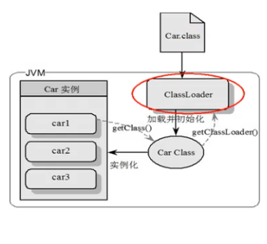
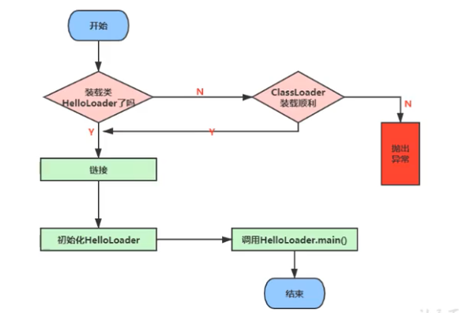

# 类加载子系统

### 内存结构概述

* LVA - Local Variables Array 局部变量表 
* OS - Operand Stack 操作数栈
* DL - Dynamic Linking 动态链接
* RA - Return Address 方法返回地址

### **类加载器\(Class Loader\)与类的加载过程**

三个阶段：**加载阶段，链接阶段，初始化阶段**

类加载器子系统负责从文件系统或网络中加载class文件，class文件在文件开头有特定的文件标识\(cafe babe\)。

ClassLoader只负责class文件的加载，至于其是否可以运行，由执行引擎决定

加载的类信息存放在一块称为方法区的内存空间。除了类的信息外，方法区中还会存放运行时常量池\(Constant pool\)信息，可能还包括字符串字面量和数字常量\(这部分常量信息是class文件中常量池部分的内存映射\)

**类加载器角色**

* class file 存在于本地硬盘上
* class file 加载到JVM中，被称为DNA元数据模板，放在方法区
* 在class file -&gt; JVM -&gt; 元数据模板过程中，类加载器扮演一个快递员的角色
* class元数据模板在方法区，class对象在堆

**类的加载过程**

**加载阶段**

* 通过一个类的全限定名获取定义此类的二进制字节流
* 将这个字节流所代表的静态存储结构转化为方法区的运行时数据结构
* 在内存中**生成一个代表这个类的java.lang.Class对象**，作为方法区这个类的各种数据的访问入口
* 加载class file的方式
  * 从本地系统直接加载
  * 通过网络获取 e.g. Web Applet
  * 从zip压缩包读取，成为日后jar, war格式的基础
  * 运行时计算生成 e.g. 动态代理技术 \(cglib\)
  * 由其它文件生成 e.g. JSP
  * 从专有数据库中提取
  * 从加密文件中获取 - 典型的防class file被反编译的保护措施 

**链接阶段**

* 分为三个子阶段：**验证，准备，解析**
* 验证
  * 目的在于确保class文件的字节流中包含信息符合当前虚拟机的要求，保证被加载类的正确性，不会危害虚拟机自身安全。如果不合法，会报verify error
  * 主要包括4种验证：文件格式验证，元数据验证，字节码验证，符号引用验证
* 准备 \(参考HelloApp.java\)
  * 为类变量分配内存并且设置该类变量的默认初始值，即零值
    * int -&gt; 0
    * float -&gt; 0.0
    * char -&gt; '\u0000'
    * boolean -&gt; false
    * 引用类型 -&gt; null
  * **这里不包含final修饰的static，因为final在编译的时候就会分配了，准备阶段会显式初始化。**被final修饰的是常量，不是变量**。**
  * **这里不会为实例变量分配初始化**，类变量会分配在方法区中，而实例变量是会随着对象一起分配到Java堆中。e.g. private static int a = 1; 在此时a 只会被设置为零值，即a=0。在初始化阶段a会被赋值为1。
* 解析
  * 将常量池内的符号引用转换为直接引用的过程
  * 事实上，解析操作往往会伴随着JVM在执行完初始化后再执行
  * 符号引用就是一组符号来描述所引用的目标。直接引用就是直接指向目标的指针、相对偏移量或一个间接定位到目标的句柄
  * 解析动作主要针对类或接口、字段、类方法、接口方法、方法类型等。

