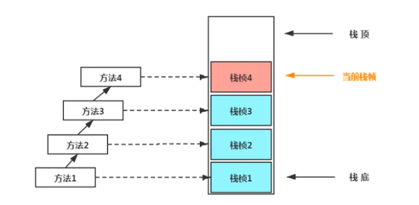
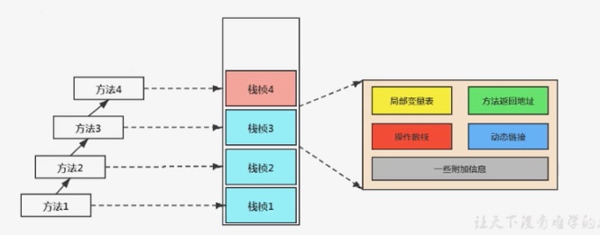
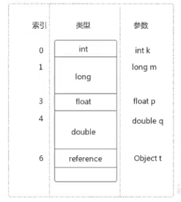
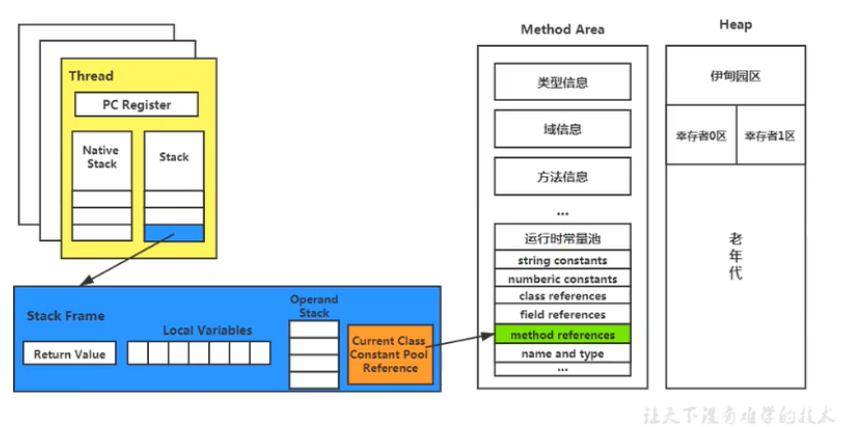
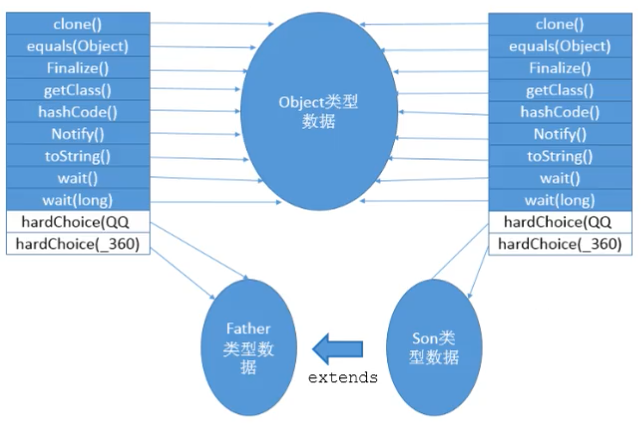
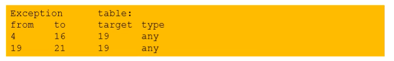

# 虚拟机栈\(JVM栈\)

## 虚拟机栈概述

由于跨平台性的设计，Java的指令都是根据栈来设计的。不同平台CPU架构不同，因此不能设计为基于寄存器的指令。相比于基于寄存器的指令，**优点是跨平台，指令集小，编译器容易实现。缺点是性能下降，实现同样的功能需要更多的指令**。

**栈是运行时的单位，堆是存储的单位。**栈解决程序的运行问题，即程序如何执行；堆解决数据存储问题，即数据怎么存、存在哪。

每个线程在创建时都会创建一个虚拟机栈，其内部保存一个个的栈帧\(Stacjk Frame\)，**一个栈帧对应一个Java方法**。JVM栈是线程私有的，生命周期和线程一致。主管Java程序的运行，它保存方法的局部变量、部分结果，并参与方法的调用和返回。

* 栈中保存的局部变量包括**8种基本数据类型**和**对象的引用地址**
* 对象本身保存在堆空间
* 变量可以分为基本数据变量和引用类型变量（类、数组、接口）

### **栈的优点**

* 栈是一种快速有效的分配存储方式，访问速度仅次于程序计数器
* 栈的操作只有进栈和出栈 - 每个方法执行伴随着进栈，方法执行结束后出栈
* 栈不存在垃圾回收\(GC\)的问题，但可能存在栈溢出\(OOM\)（程序计数器既不存在GC也不存在OOM）

### **【面试题】开发中遇到的JVM相关异常有哪些**

* JVM规范允许虚拟机栈的大小是动态的或固定不变的
  * 若采用固定大小，那么每一个线程的虚拟机栈容量可以在线程创建的时候独立选定。如果线程请求分配的栈超过虚拟机栈允许的最大容量，JVM会抛出**StackOverflowError**
  * 若可以动态扩展，但在尝试扩展时无法申请到足够的内存或者在创建新的线程时没有足够的内存去创建对应的虚拟机栈，JVM会抛出**OutOfMemoryError**

**设置栈内存大小 -Xss** - 参考 Chapter05 - StackSize 和[Java Doc](https://docs.oracle.com/en/java/javase/11/tools/java.html#GUID-3B1CE181-CD30-4178-9602-230B800D4FAE)

## 栈的存储单位

每个线程都有自己的栈，栈中的数据都是以栈帧\(Stack Frame\)的格式存在。线程上正在执行的每个方法都各自对应一个栈帧，即**方法和栈帧一一对应**。

### **栈的运行原理**

* JVM栈的操作只有**压栈**和**出栈**，遵循**先入后出**原则
* 在一条活动线程中，在一个时间点上，只有一个活动的栈帧，即只有当前正在执行的方法的栈帧（在栈顶）是有效的。这个栈帧被称为**当前栈帧\(Current Frame\)**，与其对应的方法叫做**当前方法\(Current Method\)**，定义这个方法的类叫做**当前类\(Current Class\)**
* 执行引擎运行的所有字节码指令只针对当前栈帧进行操作
* 如果在当前方法中调用的其它方法，对应的新的栈帧会被创建出来，放在栈顶，成为新的当前栈帧
* 不同线程中所包含的栈帧是不允许存在互相引用的，即不可能在一个栈帧中引用另外一个线程的栈帧
* 如果当前方法调用了其它方法，方法返回时，当前栈帧会传回此方法的执行结果给前一个栈帧，然后JVM会丢弃当前栈帧，使前一个栈帧重新成为当前栈帧
* Java方法有两种返回函数的方式，两种方式都会导致栈帧被弹出
  * 正常的函数返回，使用return指令
  * 抛出异常

### **栈帧的内部结构**

* 局部变量表\(Local Variables\)
* 操作数栈\(Operand Stack，或表达式栈\)
* 动态链接\(Dynamic Linking，或指向运行时常量池的方法引用\)
* 方法返回地址\(Return Address，或方法正常退出或者异常退出的定义\)
* 一些附加信息

## 局部变量表\(Local Variables\)

* 局部变量表也被称为**局部变量数组**或**本地变量表**
* **定义为一个数字数组，主要用于存储方法参数和定义在方法体内的局部变量**，这些数据类型包括各类基本数据类型、对象引用以及returnAddress
* 局部变量表是建立在线程的栈上，是线程私有数据，**不存在数据安全问题**
* **局部变量表所需的容量大小是在编译期确定下来的**，并保存在方法的Code属性的maximum local variables数据项中，在方法运行期间是不会改变的
* 方法嵌套调用的次数由栈的大小决定。一般来说，栈越大，方法嵌套调用次数越多。
* **局部变量表中的变量只在当前方法调用中有效。**在方法执行时，JVM通过使用局部变量表完成参数值到参数变量列表的传递过程。当方法调用结束后，**随着方法栈帧的销毁，局部变量表也会随之销毁。**
* 局部变量表中的变量也是重要的垃圾回收根节点，**只要被局部变量表中直接或间接引用的对象都不会被回收**

### **关于变量槽Slot的理解**

* 参数值的存放总是在局部变量数据的index0开始，到数组长度-1的索引结束
* 局部变量表最基本的存储单元是变量槽\(Slot\)
* 局部变量表中存放编译期可知的各种基本数据类型（8种）、引用类型、returnAddress类型的变量
* 在局部变量表中，32位以内的类型只占用一个slot（包括returnAddress类型），64位的类型（long和double）占用两个slot
  * byte, short, char， boolean在存储前被转换为int，float占一个slot
  * long和double占两个slot
* JVM为局部变量表中的每一个slot分配一个访问索引，通过索引即可访问到局部变量表中指定的局部变量值
* 当一个实例方法被调用时，它的方法参数和方法内部定义的局部变量**将会按照顺序被复制**到局部变量表中的每一个slot上
* 如果需要访问局部变量表中的一个64bit的局部变量值时，只需要使用前一个索引
* 如果当前帧是由**构造方法**或者**实例方法**创建的，那么**该对象引用this将会存放在index为0的slot**，其余的参数按照参数表顺序继续排列
* **栈帧中局部变量表中的槽位是可以重复利用的。**如果一个局部变量过了其作用域，那么在其作用域之后申明的新的局部变量就有可能会复用过期的局部变量的槽位，从而达到节省资源的目的。

### **静态变量与局部变量对比**

* 变量的分类
  * 按数据类型分：基本数据类型，引用数据类型
  * 按在类中声明的位置分：成员变量（类变量\(static\)，实例变量\(无static\)），局部变量
* 参数表分配完毕后，再根据方法体内定义的变量顺序和作用域分配
* 类变量表有两次初始化，第一次在linking的准备阶段，执行系统初始化，对类变量设置零值，另一次在初始化阶段，赋予在代码中定义的初始值
* 和类变量初始化不同，局部变量表不存在系统初始化过程，一旦定义了局部变量则必须认为的初始化，否则无法使用

## 操作数栈\(Operand Stack\)

* 操作数栈在方法执行过程中，根据字节码指令，往栈中写入数据或提取数据、即入栈或出栈
* 某些字节码指令将值压入操作数栈，其余的字节码指令将操作数取出栈，使用它们后再把结果压入栈，例如：复制、交换、求和等操作
* 操作数栈**主要用于保存计算过程的中间结果，同时作为计算过程中变量临时的存储空间**
* 操作数栈就是JVM执行引擎的一个工作区，**当一个方法刚开始执行的时候，一个新的栈帧也会随之被创建出来，这个方法的操作数栈是空的**
* 每一个操作数栈都会拥有一个明确的栈深度用于存储数值，其所需的最大深度在编译期就定义好了，保存在方法的Code的max\_stack属性中
* 栈中的任何一个元素都可以是任意的Java数据类型
  * 32bit的类型占用一个栈单位深度
  * 64bit的类型占用两个栈单位深度
* 操作数栈并非采用访问索引的方式来进行数据访问的，**而是只能通过标准的入栈和出栈操作完成一次数据访问**
* 如果被调用的方法带有返回值，其返回值会被压入当前栈帧的操作数中，并更新PC寄存器中下一条需要执行的字节码指令
* 操作数中元素的数据类型必须与字节码指令的序列严格匹配，这由编译器在编译期间进行验证，同时在类加载过程中的类检验阶段的数据流分析阶段再次验证
* Java虚拟机的解释引擎是基于栈的执行引擎，其中的栈指的就是操作数栈
* 实例参考视频P53，代码Chapter05 - OperandStack

## 栈顶缓存技术\(Top-of-Stack Caching\)

基于栈式架构的虚拟机所使用的零地址指令更加紧凑，但完成一项操作时必然需要更多的入栈和出栈指令，意味着需要更多的指令分派次数和内存读写次数。由于操作数是存储在内存中的，频繁地执行内存读写必然影响执行速度。为了解决这个问题，**HotSpot JVM采用了栈顶缓存技术，将栈顶元素全部缓存在物理CPU的寄存器中，以降低内存读写次数，提升执行引擎的执行效率**

## 动态链接\(Dynamic Linking\)

每一个栈帧内部都包含一个指向运行时常量池中该栈帧所属方法的引用。包含这个引用的目的就是为了支持当前方法的代码能够实现动态链接，例如invokedynamic指令。

在Java源文件被编译成字节码文件时，所有的变量和方法引用都作为符号引用保存在class文件的常量池里。例如，描述一个方法调用了另一个方法时，就是通过常量池（在方法区中）中指向方法的符号引用来表示的。动态链接的作用就是为了将这些符号引用转换为调用方法的直接引用。参考Chapter05 - DynamicLinking

## 方法的调用

在JVM中，将符号引用转换为调用方法的直接引用与方法的绑定机制相关

* **静态链接** - 当一个字节码文件被装载到JVM时，**如果被调用的目标方法在编译期可知，且在运行期保持不变**，这时将调用方法的符号引用转换为直接引用，这个过程称为静态链接
* **动态链接** - **如果被调用的方法在编译期无法被确定下来，即只能在程序运行期将调用方法的符号引用转换为直接引用**，这个过程称为动态链接

对应的绑定机制分别为**早期绑定\(early binding\)**和**晚期绑定\(late binding\)**。绑定是一个字段、方法或者类在符号引用被替换为直接引用的过程，仅仅发生一次。参考Chapter05 - AnimalTest

* **早期绑定** - **指被调用的目标方法如果在编译期可知，且在运行期保持不变，**即可将这个方法与所属的类型进行绑定。这样由于明确了被调用的目标方法，也就可以使用静态链接的方式将符号引用转化为直接引用
* **晚期绑定** - **如果被调用的方法在编译期无法被确定**，只能够在程序运行期根据实际的类型绑定相关的方法，这称为晚期绑定 

Java中任何一个普通的方法都具备虚函数的性质，相当于C++中的虚函数。如果在Java中不希望某个方法拥有虚函数的特征时，可以使用**final**来标记这个方法。标记为final的方法不能被重写，在编译期被确定，不具备多态的特性

### **虚方法与非虚方法**

* 如果方法在编译期就确定了具体的调用版本，这个版本在运行时是不可变的。这样的方法称为**非虚方法。**对应静态链接、早期绑定，不具备多态的特性。
* 静态方法，私有方法，final方法，实例构造器（构造器可以被重载，不能被重写），父类方法都是非虚方法
* 其它方法称为**虚方法。**对应动态链接、晚期绑定
* 子类对象多态性的使用前提：
  * 类的继承关系
  * 方法的重写
* JVM中提供了以下方法调用指令
  * 普通调用指令
    * invokestatic - 调用静态方法，解析阶段确定唯一方法版本
    * invokespecial - 调用&lt;init&gt;方法、私有及父类方法，解析阶段确定唯一方法版本
    * invokevirtual - 调用所有虚方法
    * invokeinterface - 调用接口方法
  * 动态调用指令
    * invokedynamic \(Java 7中增加的指令\) - 动态解析出需要调用的方法，然后执行
  * 前四条指令固化在虚拟机内部，方法的调用执行不可人为干预。而invokedynamic指令则支持由用户确定方法版本。**其中invokestatic和invokespecial指令调用的方法称为非虚方法，其余的\(final修饰的除外\)称为虚方法**
* 参考Chapter05 - Son

### **invokedynamic指令**

* Java7中为了实现动态类型语言支持而新增加的一个指令
* Java7中没有提供直接生成invokedyanmic的指令方法，直到Java8的Lambda表达式出现，invokedynamic指令才有了直接生成方式
* **动态语言和静态语言的区别**在于对类型的检查是在编译期还是在运行期。**静态类型语言是判断变量自身的类型信息，动态类型语言是判断变量值的类型信息。对于动态类型语言，变量没有类型信息，变量值才有类型信息。**Java是静态类型语言，但后来版本增加了动态语言支持。例如
  * Java\(静态语言\) String info = "hello"; // info = 34 -&gt; 编译时会报类型检查错误
  * JS\(动态语言\) var name = "hello"; // var name = 10; -&gt; 不会报错
  * Python\(动态语言\) info = 130.5;
* 参考Chapter05 - Lambda

### **方法的重写的本质**

* 找到操作数栈顶的第一个元素所指向的对象的实际类型，记作C
* 如果在类型C中找到与常量中的**描述符**和**简单名称**都相符的方法，则进行访问权限校验，如果通过，则返回这个方法的直接引用，查找过程结束，如果不通过，则返回java.lang.IllegalAccessError异常
* 否则，按照继承关系从下往上一次对C的各个父类进行第2步的搜索和验证
* 如果始终没有找到合适的方法，则返回java.lang.AbstractMethodError异常
* **IllegalAccessError** - 程序试图访问或修改一个属性或调用一个方法，但没有权限访问这个属性或方法。一边会引起编译器异常，如果发生在运行时，就说明一个类发生了不兼容的改变

### **虚方法表**

* 在面向对象编程中，会频繁的使用到动态分派。如果每次动态分派的过程中都要重新在类的方法元数据中搜索合适的目标，就可能影响到执行效率。因此，为了提高性能，JVM采用在类的方法区建立一个虚方法表\(virtual method table\)，使用索引表来代替查找（非虚方法在编译期就确定，因此不需要查找）
* 每个类中都有一个虚方法表，表中存放着各个方法的实际入口
* 虚方法表会在类加载的链接阶段被创建并初始化，类的变量初始值准备完成之后，JVM会把该类的方法表也初始化完毕

## 方法返回地址\(Return address\)

* 存放调用该方法的pc寄存器的值
* 一个方法的结束，有两种方式：正常执行完成或出现未处理的异常。无论哪种方式退出，在退出后都返回到该方法被调用的位置。方法正常退出时，**调用者的pc计数器的值作为返回地址，即调用该方法的指令的下一条指令的地址**。方法异常退出时，返回地址要通过异常表来确定，栈帧中一般不保存这部分信息。
* 本质上，方法的退出就是当前栈帧出栈的过程。此时，需要恢复上层方法的局部变量表、操作数栈、将返回值压入调用者栈帧的操作数栈、设置pc寄存器值等，让调用者方法继续执行下去
* **正常完成出口和异常完成出口的区别在于**：通过异常完成出口退出不会给其上层调用者产生任何返回值
* 当一个方法正常调用完成后**需要根据方法返回值的实际数据类型来确定使用哪一个返回指令**。返回指令包括**ireturn**\(返回值是boolean, byte, char, short, int\), **lreturn**\(long\), **freturn**\(float\), **dreturn**\(double\)和**areturn**\(引用类型\)。另外还有一个**return**指令供返回值为void的方法、实例初始化方法以及类和接口的初始化方法使用。
* 当一个方法遇到异常并且没有在方法内进行处理，即本方法的异常表中没有搜索到匹配的异常处理器，会导致方法退出。异常处理存储在一个异常处理表中，方便在发生异常时找到处理异常的代码

## 一些附加信息

栈帧中还允许携带与JVM实现相关的一些附加信息，例如对程序调试提供支持的信息。

## 虚拟机栈相关的面试题

### 举例栈溢出\(StackOverflow Error\)的情况？

StackOverflowError，发生在栈空间不足的情况下。可以通过-Xss设置栈的大小。若采用固定大小，那么每一个线程的虚拟机栈容量可以在线程创建的时候独立选定。如果线程请求分配的栈超过虚拟机栈允许的最大容量，JVM会抛出StackOverflowError 若可以动态扩展，但在尝试扩展时无法申请到足够的内存或者在创建新的线程时没有足够的内存去创建对应的虚拟机栈，JVM会抛出OutOfMemoryError

### 调整栈大小，就能保证不出现溢出吗？

不能。例如当递归层数太深，甚至没有终止时，依然会发生栈溢出。

### 分配的栈内存越大越好吗？

不一定。可以更大概率避免StackOverflowError。但内存空间有限，栈内存太大可能挤占内存空间导致线程数变少

### 垃圾回收是否会涉及到虚拟机栈？

不会。

| **运行时数据区** | **Error** | **GC** |
| :--- | :--- | :--- |
| 程序计数器 | No | No |
| 虚拟机栈 | Yes \(StackOverflowError\) | No |
| 本地方法栈 | Yes | No |
| 堆空间 | Yes \(OutOfMemoryError\) | Yes |
| 方法区 | Yes | Yes |

### 方法中定义的局部变量是否线程安全？

**线程安全** - 如果只有一个线程可以操作此变量，则此变量是线程安全的。如果有多个线程操作此变量，则此变量是共享变量，如果不考虑同步机制，则会存在线程安全问题。

具体视情况而定，参考Chapter05 - LocalVariablesThreadSafe

