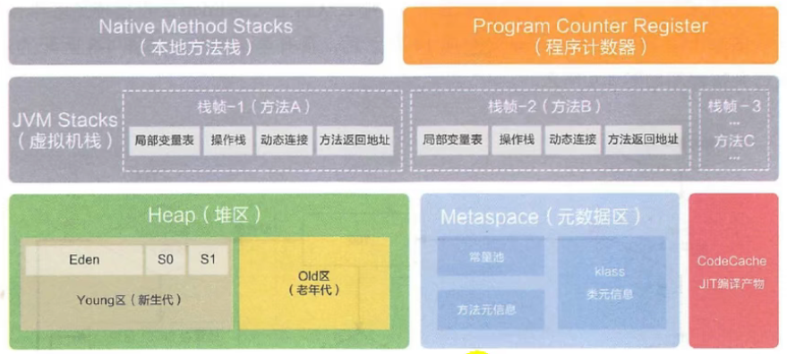

# 运行时数据区概述及线程

## 概述

JVM定义了若干种程序运行期间会使用到的运行时数据区，其中一些会随着虚拟机启动而创建，随着虚拟机退出而销毁，一个虚拟机对应一个进程。另外一些则是与线程一一对应的，这些与线程对应的数据区会随着线程的开始和结束而创建和销毁。

* 每个线程包括：程序计数器、栈、本地栈
* 线程间共享：堆，堆外内存（永久代或元空间、代码缓存）

每个JVM实例对应一个Runtime实例\(instance of class Runtime\)，即为运行时环境。

