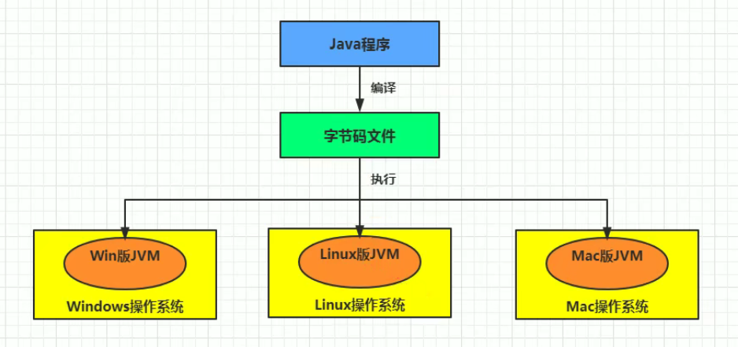

# 执行引擎

## 执行引擎概述

“虚拟机”是相对于“物理机”的概念，二者都有代码执行能力。区别在于，物理机的执行引擎是直接建立在处理器、缓存、指令集和操作系统层面上的，而**虚拟机的执行引擎是由软件自行实现的**，因此可以不受物理条件制约地定制指令集与执行引擎的结构体系，**能够执行那些不被硬件直接支持的指令集格式。**

JVM的主要任务是负责装载字节码到其内部，但字节码并不能直接运行在操作系统之上，因为字节码指令并非等价于本地机器指令，它内部包含的仅仅是一些能够被JVM所识别的字节码指令、符号表以及其它辅助信息。因此如果要让一个Java程序运行起来，**执行引擎的任务就是将字节码指令解释/编译为对应平台上的本地机器指令。**

**执行引擎的工作过程**

* 执行引擎在执行过程中究竟需要执行什么样的字节码指令完全依赖于PC寄存器
* 每当执行完一项指令操作后，PC寄存器就会更新下一条需要被执行的指令地址
* 方法在执行的过程中，执行引擎有可能会通过存储在局部变量表中的对象引用准确定位到存储在Java堆中的对象实例信息，以及通过对象头中的元数据指针定位到目标对象的类型信息

所有JVM的执行引擎输入、输出都是一致的：**输入的是字节码的二进制流，处理过程是字节码解析执行的等效过程，输出的是执行结果。**

## Java代码编译和执行过程

## 机器码、指令、汇编语言

## 解释器

## JIT编译器

