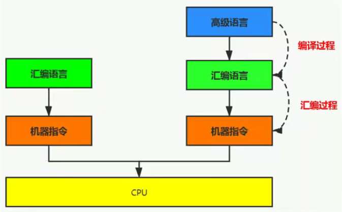

# 执行引擎

## 执行引擎概述

“虚拟机”是相对于“物理机”的概念，二者都有代码执行能力。区别在于，物理机的执行引擎是直接建立在处理器、缓存、指令集和操作系统层面上的，而**虚拟机的执行引擎是由软件自行实现的**，因此可以不受物理条件制约地定制指令集与执行引擎的结构体系，**能够执行那些不被硬件直接支持的指令集格式。**


JVM的主要任务是负责装载字节码到其内部，但字节码并不能直接运行在操作系统之上，因为字节码指令并非等价于本地机器指令，它内部包含的仅仅是一些能够被JVM所识别的字节码指令、符号表以及其它辅助信息。因此如果要让一个Java程序运行起来，**执行引擎的任务就是将字节码指令解释/编译为对应平台上的本地机器指令。**


**执行引擎的工作过程**

* 执行引擎在执行过程中究竟需要执行什么样的字节码指令完全依赖于PC寄存器
* 每当执行完一项指令操作后，PC寄存器就会更新下一条需要被执行的指令地址
* 方法在执行的过程中，执行引擎有可能会通过存储在局部变量表中的对象引用准确定位到存储在Java堆中的对象实例信息，以及通过对象头中的元数据指针定位到目标对象的类型信息

所有JVM的执行引擎输入、输出都是一致的：**输入的是字节码的二进制流，处理过程是字节码解析执行的等效过程，输出的是执行结果。**

## Java代码编译和执行过程

大部分的程序代码转换成物理机的目标代码或虚拟机能执行的指令集之前，都要经过图中这些步骤

* **橙色 -** 从程序源码到抽象语法树，是由Java源代码生成字节码指令的过程，经过javac编译**（称为前端编译）**，这部分与JVM无关
* **绿色** - 逐行解释执行
* **蓝色** - 传统的编译过程（**称为后端编译）**，最终生成机器代码

Java是半解释半编译语言

* **解释器** - 当JVM启动时，会根据预定义的规范，对字节码采用逐行解释的方式执行，将每条字节码文件中的内容翻译为对应平台的本地机器指令执行
* **JIT\(Just-In-Time\)编译器** - JVM将源代码直接编译成和本地机器相关的机器指令


Java字节码的执行是由JVM执行引擎来完成


## 机器码、指令、汇编语言




## 解释器

解释器将字节码文件中的内容翻译为对应平台的本地机器指令执行

当一条字节码指令被解释执行完成后，接着再根据PC寄存器中记录的下一条需要被执行的字节码指令执行解释操作

在Java发展历史中，有两类解释执行器，早期的**字节码解释器**和现在普遍使用的**模板解释器**：

* 字节码解释器在执行时，**通过纯软件代码模拟字节码的执行**，效率低下
* 模板解释器**将每一条字节码和一个模板函数相关联，模板函数中直接产生这条字节码执行时的机器码**，很大程度上提高了性能

## JIT编译器

### 解释器和编译器各自的优点

* 当程序启动后，解释器可以马上发挥作用，省去编译时间，立即执行，响应速度快
* 编译器把代码编译成本地机器指令需要一定的执行时间，但编译后执行效率更高
* 对于服务端应用，启动时间并非是关注的重点（所以JRockit 虚拟机中就不包含解释器），但对于看中启动时间的应用，就需要解释器与即时编译器并存的架构
* 解释执行可以在编译器进行激进优化不成立时，作为编译器的后备方案

### HotSpot JVM的执行方式

当JVM启动时，解释器可以首先发挥作用，而不必等待即时编译器全部编译完成再执行。随着程序运行，根据热点探测功能，即时编译器将有价值的字节码编译为本地机器指令，以换取更高的执行效率。

### 编译器相关概念

* **前端编译器** - 将源代码\(.java文件\)编译为字节码文件\(.class文件\)
* **后端运行期编译器** （JIT编译器，Just In Time Compiler），将字节码编译为机器指令
* **静态提前编译器**（AOT编译器， Ahead Of Time Compiler），将源代码\(.java文件\)编译为本地机器指令

### 热点代码及探测方式

* 是否需要启动JIT编译器，需要根据代码**被调用执行的频率**而定。对于热点代码，JIT编译器会对其做出深度优化，将其直接编译为本地机器指令，以提升程序执行性能
* 一个被多次调用的方法，或者一个方法体内部循环次数较多的循环体都可以被称为**热点代码**
* 目前HotSpot JVM采用的热点探测方式是**基于计数器的热点探测**。JVM会为每一个方法建立2个不同类型的计数器，分别为**方法调用计数器\(Invocation Counter\)**和**回边计数器\(Back Edge Counter\)**
  * 方法调用计数器用于统计方法的调用次数
  * 回边计数器用于统计循环体执行的循环次数
* 计数器的默认阈值在Client模式下是1500次，在Server模式下是10000次。超过阈值，则会触发JIT编译。这个阈值可以通过**-XX:CompileThreshold**来设置
* 当一个方法被调用时，JVM会先检查该方法是否存在被JIT编译过的版本。如果存在，则优先使用编译后的本地代码来执行。如果不存在，则将此方法调用计数器数值加1，然后判断计数器是否超过阈值。如果超过阈值，则会向JIT提交一个该方法的编译请求


### 热度衰减

* 如果不做任何设置，方法调用计数器统计的并不是方法被调用的绝对次数，而是相对的执行频率，即**一段时间内方法被调用的次数**。当超过一定时间限度后，如果方法调用次数仍然不足以触发即时编译，那么这个方法调用计数器会减少一半，这个过程称为**热度衰减\(Counter Decay\)**，这段时间被称为方法统计的**半衰周期\(Counter Half Life Time\)**
* 热度衰减动作是在垃圾回收时顺便进行的。可以通过**-XX:-UseCounterDecay**来关闭热度衰减。这样，只要系统运行时间足够长，大部分方法都会被编译成本地代码
* 另外，可以通过**-XX:CounterHalfLifeTime**来设置半衰周期时间，单位是秒

### HotSpot VM可设置的程序执行方式

缺省情况下，HotSpot VM采用的是解释器与即时编译器并存的架构，开发人员可以通过下面的参数更改执行方式：

* **-Xint** - 完全采用解释器模式执行程序
* **-Xcomp** - 完全采用即时编译器模式执行程序。如果即时编译出现问题，解释器会介入
* **-Xmixed** - 采用解释器+即时编译器的混合模式共同执行程序

```text
neverland@neverlands-mbp ~ % java -version
java version "1.8.0_271"
Java(TM) SE Runtime Environment (build 1.8.0_271-b09)
Java HotSpot(TM) 64-Bit Server VM (build 25.271-b09, mixed mode)

neverland@neverlands-mbp ~ % java -Xint -version
java version "1.8.0_271"
Java(TM) SE Runtime Environment (build 1.8.0_271-b09)
Java HotSpot(TM) 64-Bit Server VM (build 25.271-b09, interpreted mode)

neverland@neverlands-mbp ~ % java -Xcomp -version
java version "1.8.0_271"
Java(TM) SE Runtime Environment (build 1.8.0_271-b09)
Java HotSpot(TM) 64-Bit Server VM (build 25.271-b09, compiled mode)
```

### HotSpot VM中JIT编译器的分类

HotSpot VM中有两JIT编译器，分别为Client Compiler和Server Compiler，通常被称为**C1编译器**和**C2编译器**。开发人员可以通过下面参数选择使用哪一种编译器：（但64位操作系统只支持Server模式）

* **-client** - 指定JVM运行在Client模式下，使用C1编译器。**C1编译器会对字节码进行简单和可靠的优化，耗时短，以达到更快的编译速度**
* **-server** - 指定JVM运行在Server模式下，使用C2编译器。**C2编译器进行耗时较长的优化，以及激进优化，但代码执行效率更高**

**C1和C2编译器不同的优化策略**

* C1编译器上的主要优化策略有方法内联、去虚拟化和冗余消除（64位机也有C1编译）
  * 方法内联：将引用的函数代码编译到引用点出，这样可以减少栈帧的生成，减少参数传递以及跳转过程
  * 去虚拟化：对唯一的实现类进行内联
  * 冗余消除：在运行期间把一些不会执行的代码折叠掉
* C2编译器的优化主要在全局层面，逃逸分析是优化的基础。基于逃逸分析在C2上有如下几种优化：
  * 标量替换：用标量值代替聚合对象的属性值
  * 栈上分配：将未逃逸的对象分配在栈上而非堆上
  * 同步消除：清除同步操作，通常指synchronized

**分层编译策略**：程序解释执行可以触发C1编译，将字节码编译为机器码，可以进行简单优化，也可以加上性能监控，C2编译会根据性能监控信息进行激进优化。Java7以后会默认开启分层编译策略。

### Graal编译器

JDK10以后，HotSpot加入了一个新的即时编译器，Graal编译器。目前处于实验状态，需要使用开关参数激活才可以使用: **-XX:+UnlockExperimentalVMOptions -XX:+UseJVMCICompiler**

### **AOT编译器**

JDK9以后，HotSpot加入了AOT编译器（静态提前编译器）。AOT编译是与JIT相对的一个概念。JIT是**在程序运行过程中**将字节码转换为机器指令；AOT编译是**在程序运行之前**，便将字节码转换为机器指令。

* 优点：JVM加载已经预编译成二进制库，可以直接执行，减少了Java应用”第一次运行慢“的不良体验
* 缺点：破坏了Java”一次编译，到处运行“的优点，必须为每个不同硬件、OS编译对应的发行包。降低了Java链接过程的动态性，加载的代码在编译期就必须全部已知

\*\*\*\*


